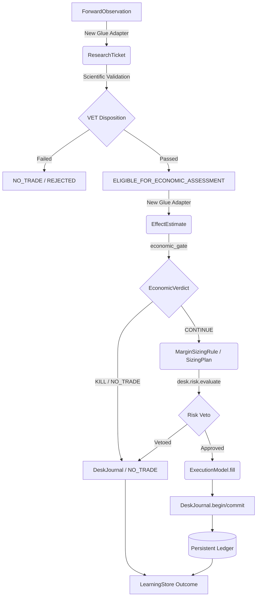

# ANTIGRAVITY — POST-P0 VERTICAL SHADOW LOOP DESIGN — 2026-09-21

## 0. Status

`ANTIGRAVITY_VERTICAL_PRESTAGE = READY_FOR_BLUE_REVIEW`

## 1. Authorities Verified

- **Blue Product Spine:** `cbf30c1bb38dd69c11fb64c523c3aec694116b9c`
- **Canonical Forward:** `parallel/claude-forward-data-2026-09-20@83521dbfdd90027c90d04adfb7d814593c2355c5`
- **Canonical Economic:** `parallel/claude-economic-v2-2026-09-20@35dff27b8fac53618da434ee6d31febbddcc0e69`
- **Interface Map Handoff:** `builder/post-p0-vertical-interface-map-2026-09-21@8d40af1f2333474d8f26509b61cb257d96f8772d`

## 2. End-to-End Contract Diagram

## 3. D1-D5 Deep Resolution

### D1: Research -> Economic Semantic Mapping
**Mapping:** `ForwardObservation` -> `ResearchTicket` -> `EffectEstimate`
- **Current State:** No explicit mapping. `ResearchTicket` contains `validation_result` (returns, Sharpe, etc.), which does not natively map to `EffectEstimate` (delta_hat, lower, upper).
- **Contract:** A new `src/quant/integration/research_economic_bridge.py` will explicitly transform `validation_result` into an `EffectEstimate`.
- **Fail-Closed:** If the research outcome cannot be faithfully translated to the frozen allocation-weighted coordinate without altering the scientific claim, the bridge returns `None`, resulting in an explicit `NO_TRADE` with reason `EFFECT_ESTIMATE_ON_FROZEN_COORDINATE_UNAVAILABLE`.
- **Fields:** `delta_hat` (mean per-trade return), `lower`/`upper` (bootstrap bounds from `validation_result`), `sample_provenance` (`dataset_fingerprint`), `evidence_label` (mapped based on dataset admissibility).

### D2: Promotion Authority Ordering (State Machine)
- **Current Defect:** `workers._finish` promotes `VALIDATED` directly to `SHADOW`.
- **Contract:** Change `workers._finish` to ONLY set `VALIDATED` (or `ELIGIBLE_FOR_ECONOMIC_ASSESSMENT`).
- **Flow:** `RESEARCH` -> `VALIDATED` -> (Economic Gate) -> If `CONTINUE`, Desk promotes to `SHADOW` during the opportunity lifecycle. This ensures economics dictate capital readiness, not just scientific falsification.

### D3: SIZE Composition
- **Current Defect:** Blue uses `capital_fraction` in `Desk._run_strategy`. Economic V2 uses `MarginSizingRule`.
- **Contract:** Economic sizing (`MarginSizingRule.fraction`) is the authoritative capital allocator for the opportunity. Desk `capital_fraction` is repurposed strictly as an absolute cap (max permitted by lifecycle).
- **Rule:** `Final_Size = min(Economic_Margin_Size, Desk_Lifecycle_Cap)`. Desk `RiskLimits` acts as the final independent veto/throttle downstream. Zero is a valid output.

### D4: Execution Consistency
- **Current Defect:** `OpeningExecutionModel` (Economic V2) and `ExecutionModel` (Blue Desk) overlap.
- **Contract:**
  - `OpeningExecutionModel` supplies research/economic cost assumptions for the `economic_gate`.
  - `ExecutionModel.fill` is the **sole execution authority** for actual shadow fills and Ledger mutation.
  - `verify_research_cost_consistency` must run between them to guarantee the economic engine isn't modeling a cheaper fill than the Desk will execute.

### D5: Durable Provenance Chain
- **Contract:** A continuous ID chain via `DeskJournal` and `Ledger` operation IDs.
  - `ForwardObservation.source_fingerprint` is saved in `ResearchTicket.source_refs`.
  - `ResearchTicket.ticket_id` feeds into `EconomicAssessmentJournal.assessment_id`.
  - `OpportunityTicket.opportunity_id` encompasses both.
  - `Ledger.apply_fill` receives a deterministic `operation_id = hash(opportunity_id + strategy_id + session_date)`.
  - `LearningStore.record_outcome` ingests this tuple, enabling full replayability and idempotence.

## 4. Minimum Changed-Path Forecast & Integration Plan

| Subsystem | Path | Action | Note |
|---|---|---|---|
| Glue | `src/quant/integration/forward_adapter.py` | `NEW_GLUE` | `ForwardObservation` -> Research Panel |
| Glue | `src/quant/integration/econ_bridge.py` | `NEW_GLUE` | `ResearchTicket` -> `EffectEstimate` (Fail-closed) |
| Factory | `src/quant/factory/workers.py` | `ADAPT` | Remove direct `VALIDATED` -> `SHADOW` |
| Desk | `src/quant/desk/desk.py` | `ADAPT` | Integrate Economic Gate & SIZE before Risk |
| Book | `src/quant/book/ledger.py` | `REUSE_AS_IS` | Provide deterministic `operation_id` to `apply_fill` |
| Learning | `src/quant/learning/store.py` | `ADAPT` | Add terminal outcome logging for the full chain |

*No whole-leaf merges. Only selected semantic contracts are copied/adapted.*

## 5. Deterministic E2E Acceptance-Test Specification

**Test File:** `tests/integration/test_first_vertical_shadow_loop.py`
**Fixture:** One synthetic `ForwardObservation` triggering a complete pipeline run.

**Path A: Legitimate NO_TRADE**
- **Trigger:** Bridge returns `None` (unavailable coordinate) OR `economic_gate` returns `NO_TRADE` due to insufficient margin vs frictions.
- **Assertions:**
  1. `OpportunityTicket` terminal state is `NO_TRADE`.
  2. `Ledger` cash/positions are strictly unmodified.
  3. `LearningStore` records `NO_TRADE` with exact economic refusal reason.
  4. Idempotence: Re-running with the same observation yields identical state without crashing.

**Path B: Positive-size SHADOW path**
- **Trigger:** High `delta_hat` bypassing all frictions, zero capacity clipping.
- **Assertions:**
  1. `economic_gate` returns `CONTINUE`.
  2. Desk applies `MarginSizingRule` for `target_notional` > 0.
  3. `desk.risk` approves.
  4. `ExecutionModel.fill` generates a shadow fill.
  5. `Ledger.apply_fill` updates cash/positions exactly once (using `operation_id`).
  6. `LearningStore` logs successful fill with `implementation_shortfall`.
  7. Idempotence: Re-running skips duplicate fill via `Ledger.has_applied`.

## 6. BLUE_DECISION_REQUIRED Packet

1. **DECISION_1 (Research -> Effect Mapping):** Does Blue accept the fail-closed fallback where Research must natively emit coordinate-compatible estimates, or should the bridge derive it heuristically? *Recommendation: Fail-closed.*
2. **DECISION_2 (SIZE Authority):** Confirm Economic `MarginSizingRule` governs allocation size, while Desk `capital_fraction` provides an absolute lifecycle ceiling.
3. **DECISION_3 (SHADOW Promotion):** Confirm `VALIDATED` no longer auto-promotes to `SHADOW` without a `CONTINUE` verdict from the economic gate.

## 7. Future Bounded Builder Mission Draft

**Branch:** `builder/post-p0-first-vertical-shadow-loop-2026-09-21`
**Base:** Blue Product Spine (post Gate-C isolated phase).
**Mission:** Implement the exact E2E vertical shadow loop specified in this design.
**Rules:**
- **MUST:** Pass `test_first_vertical_shadow_loop.py` for NO_TRADE and Fill paths.
- **MUST:** Fail closed on `EffectEstimate` gaps.
- **FORBIDDEN:** Merging full Forward/Economic leaves. Modifying `src/quant/dataplane` internals. Authorizing real capital. Altering `P0` runtime.

## 8. Opportunity-Cost Assessment

Focusing on this vertical slice rather than broad horizontal features (like generic multi-lane orchestration or dashboard UIs) is the highest-value action. It closes the primary economic uncertainty: *Can Quant successfully bridge point-in-time data through scientific evaluation into an idempotent, friction-aware booking ledger without losing provenance or double-booking?* Without this loop, any further horizontal scaling scales uncertainty, not wealth.
