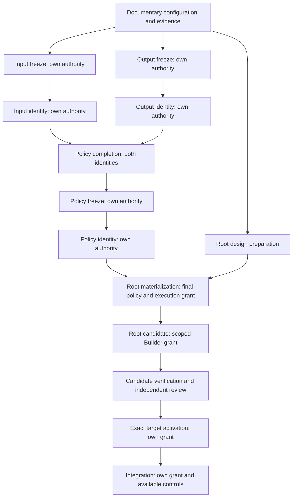

# BLUE — WEATHER V4 A1 DOCUMENTATION — 2026-10-04

ARTIFACT_TYPE = A1_DOCUMENTARY_CANDIDATE  
A1_DOCUMENTATION = READY_FOR_OWNER_REVIEW  
A1_DOCUMENTATION_SCOPE = AUTHORIZED  
THIS_DOCUMENT_APPROVES_FUTURE_EXECUTION = FALSE  
PROPOSED_MANIFESTS_AND_POLICIES_OWNER_RATIFIED = FALSE

## 1. Exact authority and authorized work

|Input authority|Exact SHA|Artifact and verified blob|
|---|---|---|
|Owner A1 decision; branch owner/weather-v4-phase-gate-a1-decision-2026-10-04|728cf23e7d69a373306f3c1a3fb5d11240210cda|research/weather_forward/v4/owner/OWNER_V4_PHASE_GATE_A1_DECISION_2026-10-04.md; 483907e4f719ec8bcb3851af0f184690cea96279|
|Blue phase-gate support|d669e603b87ac95c85c80861646de859df1b8819|research/weather_forward/v4/blue/BLUE_V4_PHASE_GATE_DECISION_SUPPORT_2026-10-04.md; db0ae4ba933041f0c1d89cb3a9f8fdbacb913aeb|
|Astra pre-op audit|926741e7a67cb80bccde0ff428f2837bb200cf19|research/weather_forward/v4/audit/ASTRA_V4_PRE_OP_CONTRACT_AUDIT_2026-10-04.md; 2f285b19dc6a61947ba7be78f48bb35425c71de6|

All exact commits/artifacts resolved independently. Owner branch HEAD equals 728cf23e…; parent is d669e603…; that support's parent is 926741e7…. These are documentary Git reads, not operational endpoint probes. Existing owner decisions, structural contract, audit qualifications, support artifacts and canonical registry are unchanged.

The owner selected Option A, authorized only A1 documentation, left A2 conditionally authorizable after prerequisite attestation, denied Option B for now, and declined C as the current path. This document implements the authorized documentation scope. It supplies proposed manifests/policies and a bounded evidence attestation; it is not an owner ratification of these proposals or a fixture/control test result.

PHASE_AUTHORIZATION = A1_ONLY_AT_INITIAL_GATE  
A2_EXECUTION_AUTHORIZED = FALSE  
A2_FIXTURE_GENERATION_AUTHORIZED = FALSE  
A2_FIXTURE_TESTING_AUTHORIZED = FALSE  
OPTION_B_AUTHORIZED = FALSE  
BUILDER_AUTHORIZED = FALSE  
CAPTURE_AUTHORIZATION = NONE  
ECONOMIC_AUTHORITY = 0  
DATA_T0 = NOT_DECLARED  
EXPERIMENT_T0 = NOT_DECLARED

## 2. Harness attestation — documentary evidence only

A2_EXISTING_APPROVED_HARNESS = NOT_ATTESTED  
A2_PREREQUISITES_COMPLETE = FALSE  
A2_BLOCKER = HARNESS_NOT_ATTESTED_AND_REQUIRED_PREREQUISITES_UNRESOLVED

|Exact reviewed governance evidence|What it establishes|What it does not establish|
|---|---|---|
|Owner A1 decision §§4–5 at 728cf23e…|Requires existing explicitly approved offline harness, identity/version/approval and required controls before considering A2|No harness identity, version, approval authority/artifact or approved fixture-generation path supplied|
|Blue phase-gate support §§3–4, 6, 10 at d669e603…|An approved existing offline harness is a prerequisite; missing implementation cannot be created under this scope|No exact harness or approval attestation|
|Astra report §§4, 7–8 at 926741e7…|Structural fail-closed requirement, no established technical implementation/effectiveness, fixture provenance firewall|No harness/control certification or actual fixture approval|

This is a NOT_ATTESTED finding within the authorized evidence corpus, not a claim that no code or harness exists anywhere. Mere code, a test directory, past test success or an agent's recollection would not prove approval for this exact scope. No source-code, test/fixture inventory, executable, actual fixture, operational registry or endpoint was searched or inspected. No harness was run.

The harness-resolution activity stops here. Remaining A1 output is documentary specification only and does not require resolving or building a harness. Owner review may later supply an exact governance attestation identifying immutable harness/version/approval scope; this document does not authorize broader searching or testing.

If a later authorized assessment establishes that any harness, vault, isolation layer, access-control mechanism, collector or runtime/control component must be newly constructed:
A2_BLOCKER = SEPARATE_BUILDER_AUTHORIZATION_REQUIRED.
That conditional rule is not a finding that construction is currently necessary; construction need is NOT_ATTESTED. No Builder assigned.

## 3. Proposed PHASE_INPUT_MANIFEST

MANIFEST_TYPE = DOCUMENTARY_CANDIDATE  
MANIFEST_SCOPE = A1_ONLY  
FUTURE_EXECUTION_APPROVED = FALSE

The following schema and populated entries specify only already-authorized governance material. They instantiate no observational source, endpoint, city, station, model, cadence, universe, credentials, real technical metadata or fixture. Required unknown future values cannot be replaced by a permissive default.

### Exact schema semantics

|Field|Required type/meaning|
|---|---|
|input_id|Immutable documentary identifier; no identifier reuse for changed bytes|
|input_classification|DOCUMENTATION_ONLY / NON_ECONOMIC_SYNTHETIC / REAL_TECHNICAL_METADATA / PROHIBITED; only DOCUMENTATION_ONLY admitted in current A1|
|source_provenance_class|Exact governance authority/support/audit or governance Git object lineage; future synthetic lineage separately attested|
|exact_permitted_fields|Finite content/field allowlist and exact SHA/path/blob binding; no wildcard traversal into linked data/code|
|exact_prohibited_fields|All content outside the allowlist plus universal prohibited classes below|
|permitted_reader_roles|Explicit role-to-input class mapping; assignment grants no operational capability|
|raw_values_visible|Whether exact permitted documentary text/metadata is visible; cannot imply visibility of operational raw values|
|timestamps_visible|Governance document dates/version history only for A1; actual observational/network/delivery timestamps denied|
|frequency_or_count_information_visible|Only documentary integrity counts such as declared unresolved entries; no operational/event/frequency counts|
|longitudinal_observation_allowed|No operational observation; fixed authority versions may be compared for documentary consistency|
|aggregation_allowed|Only documentary authority/requirement/provenance aggregation|
|cross-source_comparison_allowed|Only comparison of these governance documents; no weather/market/data-provider comparison|
|efficacy_leakage_assessment|Pre-read scope assessment and STOP rule; unexpected outcome content must not be explored or summarized|
|access_logging_requirement|Document record fields in §7; operational access logging is not implemented/certified here|
|quarantine_on_ambiguity|Required STOP/no further read-use-release at ambiguous/prohibited content; record bounded incident|
|owner_approval_required|Current A1 owner authority binding; additional input/access requires separate exact authority|

### Populated documentary input entries

The shared restriction profile below is part of each row, not a default for other input classes.

|input_id|Exact binding|source_provenance_class|exact_permitted_fields|
|---|---|---|---|
|A1-IN-OWNER|728cf23e7d69a373306f3c1a3fb5d11240210cda; Owner A1 path/blob in §1|OWNER_GOVERNANCE_DECISION|Document text defining A1 permission, prohibitions, harness/prerequisite requirements and status|
|A1-IN-SUPPORT|d669e603b87ac95c85c80861646de859df1b8819; Blue support path/blob in §1|BLUE_GOVERNANCE_SUPPORT|Documentary A/B/C definitions, proposed manifest fields, roles, fixture policy, resource/stop/incident requirements; no option executed|
|A1-IN-AUDIT|926741e7a67cb80bccde0ff428f2837bb200cf19; Astra report path/blob in §1|INDEPENDENT_DOCUMENT_AUDIT|Recorded pre-op verdict and qualifications, exact audited identity, unresolved-register integrity and phase restrictions|
|A1-IN-GIT-AUTHORITY|The three exact authority commits above and Owner A1 branch; publication identity of this new artifact|GOVERNANCE_GIT_METADATA|Commit SHA, parent/tree SHA, path/blob identity and ref identity needed for authority and publication verification; no code/data/fixture blob content|

For EVERY populated entry:
- input_classification = DOCUMENTATION_ONLY.
- permitted_reader_roles = BLUE_A1_DOCUMENT_EXECUTOR, OWNER_REVIEWER, INDEPENDENT_DOCUMENT_REVIEWER within document scope. Blue is the currently authorized role; this does not invent real independent reviewers or operational actors.
- raw_values_visible = PERMITTED_DOCUMENT_TEXT_AND_ALLOWLISTED_GOVERNANCE_METADATA_ONLY.
- timestamps_visible = GOVERNANCE_DATES_ONLY.
- frequency_or_count_information_visible = DOCUMENT_INTEGRITY_COUNTS_ONLY.
- longitudinal_observation_allowed = NO_OPERATIONAL_OBSERVATION; exact governance history only.
- aggregation_allowed = DOCUMENTARY_REQUIREMENT_AND_AUTHORITY_MAPPING_ONLY.
- cross-source_comparison_allowed = GOVERNANCE_DOCUMENT_CONSISTENCY_ONLY.
- exact_prohibited_fields = real weather/market/trading/efficacy data; operational metadata/availability/timing/cadence/gaps/delivery; performance/rankings; operational credentials; fixtures/generator output/code execution; linked datasets/code/fixtures not opened merely because referenced.
- efficacy_leakage_assessment = AUTHORITY_TEXT_SCOPE_ONLY; unexpected efficacy-bearing material triggers STOP, not an expanded analysis.
- access_logging_requirement = §7 documentary record; quarantine_on_ambiguity = REQUIRED.
- owner_approval_required = SATISFIED_FOR_THIS_A1_DOCUMENT_SCOPE_BY_728cf23e…; any expansion remains unapproved.

Abstract future field classes only: fixture lineage/generator version, synthetic technical interface fields, restricted real technical field-presence/type classes. They have no populated record, actual content, operational identifier or A1 access permission. NON_ECONOMIC_SYNTHETIC is not admitted for actual inspection in A1; REAL_TECHNICAL_METADATA remains prohibited.

## 4. Proposed PHASE_OUTPUT_MANIFEST

This is a documentary candidate, not an operational release configuration. All logical output entries below are sections of this one Markdown file; they create no fixture, test result, response sample or runtime artifact.

### Exact output schema semantics

Every field is required. The shared restriction profile following the entries supplies explicit values for each row, not defaults for later A2/B outputs. Unknown future values prohibit the corresponding release.

|Field|Required type/meaning|
|---|---|
|output_id|Immutable logical output identifier bound to this artifact/version|
|output_type|DOCUMENTATION_ONLY for every current row; no technical finding or measured-result class admitted|
|exact_metric_or_artifact|Exact document section and defined documentary claim; no measured operational metric|
|granularity|Explicit maximum visible documentary detail; operational values and correlated proxies excluded|
|permitted_recipients|Finite authorized documentary role set; no implicit administrator/research exception|
|exportability|Exact permitted documentary destination/use; all other release paths denied|
|quarantine_status|Candidate/review state; ambiguous or prohibited content must be withheld|
|cumulative_disclosure_risk|Assessment including prior recipient knowledge, combined content and indirect disclosure|
|efficacy_leakage_assessment|Documentary-only assessment; unresolved efficacy risk blocks release|
|release_approval_requirement|Exact current A1 scope reference; later operational release requires separate authority|
|retention_rule|Governance record treatment and unresolved future retention choice; no invented period|
|incident_if_unexpected_information_revealed|Required STOP/quarantine/exposure/review mapping to §8|

### Populated documentary output entries

|output_id|exact_metric_or_artifact (output_type = DOCUMENTATION_ONLY for all rows)|granularity|
|---|---|---|
|A1-OUT-AUTHORITY|Documentary authority and scope receipt (§1)|Exact governance SHA/path/blob and permission semantics|
|A1-OUT-MANIFESTS|Input/output schema and admitted governance-only rows (§§3–4)|Field/class/role-level allow/prohibit semantics; no real-data examples|
|A1-OUT-CAPABILITIES|Abstract role/capability specification (§5)|Role-to-class access; actual future assignments unresolved|
|A1-OUT-FIXTURE-POLICY|Fixture admissibility/provenance specification (§6)|Construction-input/generator/version/log rules only|
|A1-OUT-LOG-INCIDENT|Logging, STOP, quarantine and reclassification specification (§§7–8)|Exact documentary fields and incident actions; no actual operational logs|
|A1-OUT-HARNESS-A2|Harness status and A2 prerequisite matrix (§§2, 9)|VERIFIED/UNRESOLVED/NOT_ATTESTED/NOT_APPLICABLE with cited documentary evidence, no technical test|
|A1-OUT-B-RESOURCES|Option B prerequisite and resource/time decision fields (§§10–11)|Dependency/permission boundaries; no request, credential, endpoint or numerical budget|

For EVERY output entry:
- permitted_recipients = OWNER_REVIEWER and independently assigned document reviewer; BLUE_A1_DOCUMENT_EXECUTOR may produce/check the document.
- exportability = authorized repository publication and owner handoff of this A1 document only; no messaging, operational export or data release.
- quarantine_status = PROPOSED_DOCUMENT_FOR_OWNER_REVIEW; unexpected prohibited information must be quarantined rather than included.
- cumulative_disclosure_risk = review all sections/previous documentary disclosures together; no operational time series, source ranking or efficacy summary may emerge by joining sections.
- efficacy_leakage_assessment = governed documentary statements only; unresolved ambiguity blocks affected publication/release.
- release_approval_requirement = A1 permits this documentary deliverable; owner must review before any further authority transition. Future A2/B releases require their own exact approval.
- retention_rule = committed governance history preserved under repository practices; operational log retention duration remains OWNER_DECISION_REQUIRED; no numeric duration invented.
- incident_if_unexpected_information_revealed = STOP and §8 actions; deletion never restores blindness.

Operational metric field: no measured availability, timing, latency, frequency, gap, delivery, profitability or efficacy metric is permitted. Documentary counts/statuses are integrity observations, not economic evidence.

## 5. Role/capability matrix and interface boundaries

These are abstract specifications, not actual appointments or implemented ACLs. Current document access is limited to the explicit input/output reader sets in §§3–4. Other role titles below describe future duties; a title alone grants no access. Research, custody or incident personnel would need an explicitly permitted documentary reader assignment before any current document view, and separate exact permissions before any later operational view.

|Role|A1 permitted capability|Prohibited / future unresolved|
|---|---|---|
|PHASE_OWNER / OWNER_REVIEWER|Review exact documents, select/ratify later bounded decisions|No phase implied by receipt/review; actual future resource/access assignments unresolved|
|BLUE_A1_DOCUMENT_EXECUTOR|Read allowlisted governance, author this specification and publish/verify its documentary identity|No operational execution, fixture inspection/generation, runtime, credential, harness or data access|
|CUSTODY_ADMIN|Conceptual duty: protect lineage/quarantine/logs; documentary design only now|No vault/key/admin/decrypt/operational capability provisioned; actual actor unresolved|
|RESEARCH_VIEWER|Approved documentary content only|No raw/intermediate observational/fixture/metadata view under A1|
|RELEASE_APPROVER|Conceptual independent review of scope/provenance/cumulative disclosure; documents only|No real release permission assigned; cannot grant A2/B/capture from a documentary result|
|INCIDENT_AUTHORITY|Conceptual STOP, bounded notice, exposure classification and request for precise owner instruction|No blanket authority to open quarantined data to investigate|
|INDEPENDENT_DOCUMENT_REVIEWER|Exact documentary consistency review when assigned|No claim of independent technical controls testing or operational access|

Access policy covers raw inputs, intermediates, logs, dashboards, error messages, debug traces, admin interfaces, key-management interfaces, indirect summaries and correlated metadata. Each future accessible class needs exact reader/recipient roles before access, not just export restrictions. If an administrator/agent/human sees efficacy-bearing information, suppressing an export cannot undo exposure.

A1 implements no vault, isolation, access controls, logging service or new harness. Its schema/interface documentation specifies fields, immutable provenance references, role boundaries, permitted projections and failure handling only. Actual field existence, parsing and interface behavior remain untested.

CAPTURE_IDENTITY != RESEARCH_IDENTITY remains the structural requirement for later applicable phases, not a deployed fact.
UNBLIND_IMPLEMENTATION_REQUIRED = ONLY_IF_REQUIRED_BY_THE_EXACT_AUTHORIZED_PHASE.
A1 requires no unblind/decryption/operational credentials; all remain prohibited or deferred. Later A2 must not acquire real validation access merely to test interfaces.

## 6. Fixture admissibility and provenance policy only

SYNTHETIC_LABEL_ALONE_ESTABLISHES_SAFETY = FALSE  
FIXTURES_CREATED = NONE  
ACTUAL_FIXTURES_INSPECTED = NONE  
ACTUAL_FIXTURES_APPROVED = NONE

|Policy field|Exact proposed rule|
|---|---|
|Allowed construction-input classes|Approved outcome-free DOCUMENTATION_ONLY schema/static-interface rules and independently attested NON_ECONOMIC_SYNTHETIC abstractions; no instance admitted now|
|Prohibited construction-input classes|Real observations or efficacy-revealing metadata/statistics: prevalence, signal, opportunities, market response, rankings, favored city/station/model/source, profitable latency, PnL, performance distributions, indirect summaries/calibrated priors derived from them|
|Provenance requirement|Complete immutable input lineage, author/agent construction history, permission basis, source/version/hash and declared rationale for each construction input; UNKNOWN fails closed|
|Generator/version requirement|Exact existing approved generator/harness identity/version and construction path must be attested before future generation; no invented generator, code or seed now|
|Input disclosure|Declare every material construction input and transformation; masked/randomized/aggregated/anonymized real calibration remains real-informed|
|Reproducibility requirement|Future approved generation must be reproducible from pinned permitted inputs, generator/method/version and declared randomization state where applicable; reproducibility alone does not establish admissibility|
|Logging requirement|Record generation authority, input/generator/content identity, actor/readers, intermediate views and release decisions; no hidden use of prior real efficacy exposure|
|Contamination rule|If real efficacy materially informed construction, classify according to actual provenance/exposure; fixture is not NON_ECONOMIC_SYNTHETIC merely by label|
|Quarantine rule|Deny generation/use/release on ambiguous or prohibited lineage; quarantine affected inputs/derivatives if encountered, append exposure/incident and await exact owner instruction|

Permitted future concepts could include abstract schema type/error boundaries and role-transition cases unrelated to real source behavior. No test vectors, fixtures, distributions, numeric examples, seeds or runnable generator are supplied. A1 cannot approve an actual fixture; prospective admission after a later exact authorization must be checked by appointed roles under the frozen policy.

## 7. Logging specification and documentary access record

LOGGING_CONTROL_IMPLEMENTED_OR_TESTED_BY_A1 = FALSE.

Future access-log specification:
record_id; authority_sha; manifest_version; artifact/input/output_id; immutable content/version reference; actor_role and assigned identity; permitted action; read/view/generation/release class; direct/indirect exposure class; access result; recipient set; supersedes; incident_id; quarantine/release decision and approver; resource-bound check; logging provenance/integrity reference. Where applicable, actual wall-clock logs must be segregated if they could reveal source/request/delivery patterns. Research-readable logs must not include secrets, prohibited values, operational timestamps/counts or their proxies.

Logs must account for denied/aborted acts, administrator/key capabilities and intermediate views, not merely exports. Append-only correction semantics; no silent erasure or backdated claim of access. Storage/retention, actual actors/control implementation and operational effectiveness are unresolved. A1 specifies these controls only.

Actual documentary receipt for this mission:
- three mandatory exact commit objects and three documents in §1 read through governance connector;
- Owner A1 branch identity verified;
- this document's Git identity/content and scope checked for publication;
- harness attestation limited to the cited governance text in §2;
- no source-code/fixture/harness execution or operational data/metadata accessed.

This receipt and Git history are documentary provenance, not proof of a deployed immutable access-log service. No exact per-access time is invented.

## 8. STOP, incident, quarantine and reclassification specification

THE_CONTRACT_REQUIRES_FAIL_CLOSED_BEHAVIOR  
TECHNICAL_CONTROL_IMPLEMENTATION_ESTABLISHED = FALSE  
TECHNICAL_CONTROL_EFFECTIVENESS_VERIFIED = FALSE

A1 must stop the affected activity if further completion requires prohibited data/metadata, fixture generation/inspection, endpoint access, credentials, code/harness execution, Builder or new infrastructure/control implementation. Record unresolved status and return to owner; no substitute route.

Required trigger classes:
UNEXPECTED_OUTCOME_BEARING_INFORMATION; EFFICACY_REVEALING_DATA; UNAUTHORIZED_RAW_DATA; AMBIGUOUS_INPUT_PROVENANCE; FIXTURE_PROVENANCE_VIOLATION; ACCESS_CONTROL_VIOLATION; UNEXPECTED_PRIVILEGED_ACCESS; OUTPUT_CAPABLE_OF_RANKING_FAMILIES; OUTPUT_CAPABLE_OF_RANKING_CITIES; OUTPUT_CAPABLE_OF_RANKING_STATIONS; OUTPUT_CAPABLE_OF_RANKING_MODELS; OUTPUT_CAPABLE_OF_RANKING_SOURCES; TIMING_INFORMATION_REVEALING_EDGE_ADVANTAGE; RESOURCE_BOUNDARY_EXCEEDED; INPUT_MANIFEST_MISMATCH; OUTPUT_MANIFEST_MISMATCH; UNAUTHORIZED_CROSS_SOURCE_COMPARISON; UNAUTHORIZED_LONGITUDINAL_AGGREGATION; REQUIRED_UNAUTHORIZED_IMPLEMENTATION_OR_EXECUTION.

For each trigger, the proposed incident workflow requires:
1. STOP implicated activity; no further reads/requests/generation and no autonomous retry.
2. LOG bounded class, authority/manifest/role/artifact identity and known/unknown scope. Do not quote unsafe values in ordinary logs or notices.
3. QUARANTINE implicated input/output/intermediate/log/derivatives through an already-authorized mechanism; if no permitted mechanism exists, stop and request exact owner direction rather than implementing one.
4. ACCESS_FROZEN and RELEASE_BLOCKED for affected surfaces, rights and cumulative summaries.
5. SURFACE_RECLASSIFIED_IF_APPLICABLE using actual direct/indirect correlated exposure: UNKNOWN when incomplete, DEVELOPMENT_ONLY or DISCOVERY_CONTAMINATED where justified; no new CONFIRMATORY_CLEAN certificate.
6. ESCALATED_TO_OWNER with safe evidence references and unresolved impact; no permission inferred to inspect quarantine.
7. INVESTIGATED_BEFORE_RESUME under exact authority, independently reviewed where required; owner direction needed before any expansion/resumption across the blocked boundary.

Missing provenance/access logs cannot be treated as no exposure. Incident reclassification must consider related hypotheses, dates/stations/systems/releases and derived summaries without opening prohibited data to prove cleanliness. Logical field-presence outputs, their repetitions, counts/order/timing and combined knowledge can disclose efficacy; accumulation must stop at uncertainty, not after a series has already been inspected.

CAPTURED != CLEAN  
SEALED != CONFIRMATORY_CLEAN  
DELETION_OF_LEAKED_INFORMATION_DOES_NOT_RESTORE_BLINDNESS

## 9. Future A2 prerequisite matrix — no activation

Status definitions:
VERIFIED = supported by the exact authorized documentary evidence for the stated claim only.
UNRESOLVED = future specification/decision absent or not ratified.
NOT_ATTESTED = required identity/approval/control evidence not supplied in the authorized corpus.
NOT_APPLICABLE = capability excluded from this A1 scope; not a waiver for a later changed phase.

|Prerequisite|Status|Exact finding / required later evidence|
|---|---|---|
|A1 documentary authorization|VERIFIED|Owner 728cf23e… authorizes A1 only|
|A2 prohibition until separate prerequisites/decision|VERIFIED|Owner §§2, 5; all three A2 authorization flags FALSE|
|Existing harness identity|NOT_ATTESTED|Need explicit immutable harness identity/path without inferring approval from code presence|
|Harness version|NOT_ATTESTED|Need exact approved version/commit/artifact hash|
|Harness approval authority|NOT_ATTESTED|Need exact authority empowered for this scope|
|Harness approval evidence|NOT_ATTESTED|Need explicit approval artifact tied to version and permissible tests; none in reviewed corpus|
|Fixture-generation path|UNRESOLVED|Need approved existing path/toolchain linked to attested harness; no path selected|
|Allowed fixture inputs|UNRESOLVED|Policy proposed in §6; actual pinned admissible generation inputs not approved/inspected|
|Prohibited fixture inputs|VERIFIED|Owner real-efficacy provenance prohibition is binding; enforcement NOT_ATTESTED|
|Output allowlist|UNRESOLVED|A1 documentary entries exist; later A2 exact technical outputs/metrics and granularity require ratification|
|Quarantined outputs|UNRESOLVED|Categories specified; actual quarantine capability/read permissions NOT_ATTESTED|
|Reader roles|UNRESOLVED|Abstract matrix exists; actual A2 assignments/access limits not supplied|
|Release roles|UNRESOLVED|Independent exact approver/recipients/permissions not appointed|
|Logging controls|NOT_ATTESTED|Specification present; no deployed integrity/access logs tested or certified|
|STOP rules|UNRESOLVED|Proposed documentary rules need exact A2 binding; actual enforcement NOT_ATTESTED|
|Incident controls|NOT_ATTESTED|No operational containment/investigation/independent-resume capability established|
|Resource/time bounds|UNRESOLVED|§11 fields have no owner-ratified numerical values|
|Whether Builder work is required|NOT_ATTESTED|Cannot infer a construction need or absence of one without authorized attestation; no Builder assigned|
|Real-data/operational endpoint/credential/capture capability|NOT_APPLICABLE|Excluded from contemplated offline A2; remains prohibited absent a different separate owner decision|
|Validation unblinding/decryption|NOT_APPLICABLE|No need for this offline documentary/fixture scope; remains prohibited|
|Separate exact A2 execution/generation/testing owner authority|UNRESOLVED|Prerequisites alone never activate A2; current flags remain FALSE|

Current outcome: A2_PREREQUISITES_COMPLETE = FALSE. No existing approved harness is resolved. Even later documentary identity attestation would not alone prove control effectiveness. Any required technical verification must itself be covered by a later precise authority; A1 does not execute tests to fill this gap.

Separate Builder need register: harness construction; fixture-generator construction; vault/isolation/access-control implementation; logging/quarantine/control infrastructure; collector/runtime modification — all NOT_ATTESTED_AS_NEEDED, all PROHIBITED_IN_A1. If any is required, STOP = SEPARATE_BUILDER_AUTHORIZATION_REQUIRED. The owner must separately authorize it; do not infer Builder authorization from A1/A2 prerequisites.

## 10. Option B prerequisite map — documentation only

OPTION_B_AUTHORIZED = FALSE  
OPTION_B_DESIGN != OPTION_B_EXECUTION

|Prerequisite|Status|Before later B consideration/execution|
|---|---|---|
|Exact safe technical question and request/response field boundaries|UNRESOLVED|Owner must specify without efficacy leakage; no endpoint/source/model/city/station/request populated now|
|Rights/credential scope and actual actors|UNRESOLVED|Need precise later authority; no credential value requested or used|
|Safe input restriction before any read/processing|NOT_ATTESTED|No raw observations may be fetched merely to redact later; if no safe interface, B unavailable|
|Actual isolation/admin/log/error/dashboard controls|NOT_ATTESTED|Need evidence under separate permitted work; cannot build or test them in A1|
|Input/output/metric allowlists and recipients|UNRESOLVED|Exact approved metadata classes, cumulative disclosure controls and quarantine permissions|
|Timestamp/frequency/delivery boundary|VERIFIED|Current permission excludes actual values/distributions/lead-lag, cadence/gaps/delivery and efficacy-revealing patterns; no measurement authorized|
|Longitudinal and cross-source restrictions|VERIFIED|No outcome-revealing aggregation/comparison; operational enforcement NOT_ATTESTED|
|Stop/incident/resource/time bounds|UNRESOLVED|Exact binding and actor/capability proof required; no values supplied|
|Separate Owner Option B phase-gate|UNRESOLVED|A1, Astra PASS and completed documentation cannot grant B|
|Unblinding / collector / Builder|NOT_APPLICABLE|Excluded from proposed restricted B scope; if implementation required, distinct authority needed|

B may potentially ask logical endpoint/auth/schema/field/document/version questions only after exact safe authorization. This mission answers none. Field existence differs from parseability, actual timestamp, timestamp distribution, relative source latency, relative market latency and market-response comparison. No safe label permits actual efficacy-bearing timing/count/availability/delivery evidence.

## 11. Resource/time decision fields and dependency timing

|Field|Current documentary value|Why later choice matters|
|---|---|---|
|MAX_CALENDAR_DURATION|OWNER_DECISION_REQUIRED|Bounds any future phase and prevents open-ended extension|
|MAX_COMPUTE|OWNER_DECISION_REQUIRED|Prevents unapproved processing/testing commitment|
|MAX_STORAGE|OWNER_DECISION_REQUIRED|Bounds artifacts, intermediates and quarantine footprint|
|MAX_EXTERNAL_CALLS_IF_ANY|A1 calls to operational endpoints prohibited; future B quota OWNER_DECISION_REQUIRED|No polling or probing inferred from technical scope|
|MAX_HUMAN_ACCESS|OWNER_DECISION_REQUIRED|Actual readers and privilege exposure limits|
|MAX_AGENT_ACCESS|OWNER_DECISION_REQUIRED|Agent/session knowledge and cumulative disclosure|
|ALLOWED_CREDENTIAL_SCOPE|A1 operational credentials prohibited; future B scope OWNER_DECISION_REQUIRED|No credential acquisition/use from generic role names|
|MAX_OUTPUT_VOLUME|OWNER_DECISION_REQUIRED|Bounds releases; volume cap alone cannot prove safety|
|MAX_LOG_RETENTION|OWNER_DECISION_REQUIRED|Accountability and secure retention without invented duration|
|MONETARY_BUDGET|OWNER_DECISION_REQUIRED|No spending commitment inferred|
|STOP_ON_RESOURCE_LIMIT|Required boundary rule; applicable limit remains unresolved|No automatic quota increase or retry past the cap|

No duration, money, compute/storage amount, call quota, human/agent limit or retention duration is invented. Producing this authorized documentary deliverable does not allocate operational resources.

Before later A2/B authorization: exact scope/manifests/provenance classes, actual roles/permissions, bounds, incident/stop obligations and required capability/approval evidence must be explicitly addressed. Before execution: all applicable approved identity/version/control prerequisites must be attested and the exact owner execution decision must exist. Neither documentary proposal nor evidence of a prerequisite automatically grants execution.

Can remain unresolved in A1: actual harness approval, generator path, fixture instances, actors/operational control implementation, credentials, endpoints and numerical limits. Their absence is reported, never filled by assumption. Only the already-declared unresolved portions of economic selection/error/block/power/Book/risk/capacity definitions remain for the corresponding later contract; technical documentation neither resolves nor waives them. Ratified economic preferences, primary horizon, persistent Book and structural choices remain unchanged; no ratified choice is reopened.

DECLARED_UNRESOLVED_FIELD_COUNT = 41  
EXHAUSTIVENESS_CERTIFIED = FALSE

No canonical register modification. Stage-1 input/output/metric specifications refine EXACT_NON_ECONOMIC_FEASIBILITY_SCOPE and RELEASE_PERMISSIONS. Further harness/control/role/resource requirements here are OPTION_SPECIFIC_PHASE_DEPENDENCY; not an automatic 42nd field.

## 12. Completion boundary and handoff

A1_DOCUMENTATION = READY_FOR_OWNER_REVIEW means the authorized documentary package is complete for review, including honest NOT_ATTESTED/UNRESOLVED findings. It does not claim A2 readiness, actual harness/control existence or admissibility of any fixture.

A2_EXISTING_APPROVED_HARNESS = NOT_ATTESTED  
A2_PREREQUISITES_COMPLETE = FALSE  
A2_BLOCKER = HARNESS_NOT_ATTESTED_AND_REQUIRED_PREREQUISITES_UNRESOLVED

OPTION_B_EXECUTED = NO  
REAL_DATA_ACCESSED = NONE  
REAL_METADATA_ACCESSED = NONE  
FIXTURES_CREATED = NONE  
HARNESS_EXECUTED = NO  
REPOSITORY_CODE_EXECUTED = NO  
EXTERNAL_ENDPOINTS_QUERIED = NONE  
CREDENTIALS_USED = NONE  
BUILDER_USED = NO  
DATA_T0 = NOT_DECLARED  
EXPERIMENT_T0 = NOT_DECLARED  
t0 = NOT_DECLARED  
ECONOMIC_AUTHORITY = 0  
ECONOMIC_DECISION_WEIGHT = 0  
COMPOSITE_ECONOMIC_AUTHORITY = 0  
CAPTURE_AUTHORIZATION = NONE  
REAL_CAPITAL_AUTHORIZED = FALSE  
LIVE_TRADING_AUTHORIZED = FALSE  
UNBLIND_AUTHORIZED = FALSE  
OPERATIONAL_SOURCE_SELECTED = NONE  
FULL_VALIDATION_CONTRACT_COMPLETE = FALSE  
READY_FOR_FINAL_VALIDATION_CONTRACT_AUDIT = FALSE  
OBSERVATION_AUTHORITY = UNCHANGED

“External endpoints/metadata/credentials NONE” refers to operational/weather/market/technical feasibility; authorized governance connector reads and document publication are recorded in §7 and are not Option B execution. No fixtures, tests, shell/repository programs, technical controls, runtime or operational sources were used to verify these documents.

ASTRA_PASS != PHASE_AUTHORIZATION  
BLUE_DOCUMENTATION != A2_AUTHORIZATION

ECONOMIC_PROGRESS = exact governance-only manifests, access/fixture/incident policy and prerequisite gaps made reviewable without operational exposure.
REMAINING_BLOCKER = absent exact approved harness attestation and incomplete later A2/B prerequisites/authority.
EXIT_CONDITION = owner review of this A1 package; no further execution until separate exact authority.
FILES_MODIFIED_OUTSIDE_SCOPE = NONE.
NEXT_SAFE_ACTION = OWNER REVIEW ONLY; owner may provide exact already-existing approval evidence or decide a separate bounded authority. Do not execute A2/B or assign Builder.

## 13. A2 documentary governance integration configuration — 2026-10-05

### 13.1 Candidate status, authority and chronology

CONFIGURATION_ID = BLUE_A2_DOCUMENTARY_INTEGRATION_CANDIDATE_V1  
A2_INTEGRATION_MODE = DOCUMENTATION_ONLY_NO_FIXTURE  
DOCUMENTARY_REVIEW_ONLY = TRUE  
PROPOSED_CONFIGURATION_OWNER_RATIFIED = FALSE  
A2_OPERATION = DOCUMENTARY_INPUT_READ_THEN_STRUCTURAL_REPORT_RELEASE_CANDIDATE  
DIGEST_STATUS = PENDING_AUTHORIZED_COMPUTATION  
DRAFT_COMPLETE != EXECUTION_READY  
DRAFT_COMPLETE != OWNER_RATIFIED  
ASTRA_PASS != PHASE_AUTHORIZATION

This is one proposed configuration, appended to the existing A1 dossier. Sections 1–12 are preserved verbatim as the historical A1 record. Their then-current harness NOT_ATTESTED findings are not retroactively completed. This section uses later exact evidence and documents outstanding decisions; it does not amend an Owner Decision, implement a control, generate an object or approve execution. No new document, companion, configuration file, fixture, test object or runtime artifact is created.

|Reference|Exact verified identity|Meaning for this draft|
|---|---|---|
|Owner A1 authority|728cf23e7d69a373306f3c1a3fb5d11240210cda; OWNER_V4_PHASE_GATE_A1_DECISION_2026-10-04.md; blob 483907e4f719ec8bcb3851af0f184690cea96279|§§3–4 authorize manifest, schema/interface, role/access, logging, provenance, STOP/incident and prerequisite documentation; proposals do not activate A2. Artifact remains byte-identical at review snapshot|
|Review snapshot / Astra PASS|31215914a7e11daa20ca0189d859bb69827a055c; audit/ASTRA_V4_A2_D5_TYPE_REPAIR_RUNTIME_EVIDENCE_AUDIT_2026-10-05.md; blob 0deae36fba1962fe9249cffbe787f0680b5abfd8|PASS_D5_TYPE_REPAIR_AND_BOUNDED_RUNTIME_EVIDENCE; sole parent is harness reference. Not execution authority, deployed-control certification or fixture approval|
|Harness reference|78d537de681363ed83a6c7787aba4319f3c73c4d|Exact source reference for all schema/interface descriptions below, not an A2 execution permit|
|Original construction authority|37e3b25f17a7c5d3b3bc8d37df730aa988585b6c; owner/OWNER_V4_A2_DEDICATED_HARNESS_BUILDER_DECISION_2026-10-04.md; blob 81d2ad4dac7ed50173442448437c9a23cc1ef51e|Historical dedicated-harness construction authority; verified exact commit/artifact. Distinct from A1 and future execution-policy authority|

Paths in the table are relative to research/weather_forward/v4/ except the exact A1 authority SHA. A1 is an ancestor of the review snapshot (27 commits ahead, zero behind; merge base equals A1). The snapshot directly follows the exact harness reference. A1 authorizes this drafting activity because it is only documentation/specification and consistency inspection of already-authorized governance and interfaces. Its STOP rule is preserved: no harness-resolution search, runtime verification or new construction is performed to fill remaining unknowns. The later Astra evidence resolves the identity of the reviewed dedicated implementation and its bounded test evidence only; suitability/approval for this new integration operation remains an Owner decision.

Authority chain for this section: A1 permission → later exact source and bounded Astra review as evidence → this documentary candidate → Owner review/ratification → any separately authorized technical transition/execution. Neither review evidence nor this candidate is a phase authorization.

### 13.2 Exact schemas and classification discipline

|Source at harness reference SHA|Verified Git blob|Schemas / interfaces read as text only|
|---|---|---|
|a2_harness/contract.py|f6f94a4a472e3f6652a1502f6afb5825721364d0|InputManifest; OutputManifest; AuthorityBinding; RoleDeclaration; ActionAuthorization; TrustedExecutionPolicyRoot; LogRecord; LogAppendAcknowledgement; StructuredAuditLog; DisclosureRecord; CumulativeDisclosureLedger; HarnessDecision; LoggedActionResult; fixture provenance interfaces and enums|
|a2_harness/harness.py|00ae81d2823b7d30d72aabe8d82ac051dbfcf5c4|HarnessPolicy; identity/canonicalization functions; authority/manifest/role checks; A2Harness.evaluate_input_read and evaluate_output_release; acknowledged finalization and resource-state interface|
|a2_harness/trusted_root.py|9d8adeca4b61e42c40bd7f9ec85e4f3b676b1b94|Current production constants and resolver are None|
|a2_harness/README.md|b3b74326d2d41f1d88c9e891186a5af9a663f095|Construction versus execution authority; current no-root and no approved recipient state; limits of in-memory logging|

Each requirement row below has exactly one classification:
- SUPPORTED_SCHEMA_FIELD: a real field or existing typed interface value, not a guarantee that its semantic content is enforced.
- DOCUMENTARY_CONSTRAINT: an obligation for the frozen scope, review or procedure outside runtime fields.
- UNSUPPORTED_BY_CURRENT_SCHEMA: a missing representation or enforcement capability; no enforcement claim.
- FUTURE_IMPLEMENTATION_REQUIREMENT: a specifically identified technical change needed for permissive future operation, requiring separate authority.

Related representations and missing enforcement are separate requirements, not double-classification of one row. Enum names here denote documentary candidate values only. No Python constructor, JSON configuration object, manifest instance, policy instance, log record or test object has been created.

### 13.3 One bounded candidate operation

PURPOSE = determine, only in a separately authorized later operation, whether exact documentary manifest/policy/actor bindings can reach the existing guarded decision-and-log interfaces and whether their returned structural linkage matches the frozen configuration. This is an interface/governance integration objective derived from A1 manifest, role, logging and consistency objectives; no new research objective.

Candidate sequence, not executed:
1. An appointed EXECUTOR/input reader calls evaluate_input_read once with the single input manifest in §13.4, its exact AuthorityBinding/HarnessPolicy, matching READ_INPUT authorization, a StructuredAuditLog and a unique read log_record_id.
2. Only if the read result satisfies the approved structural expectations, the independent RELEASE_APPROVER calls evaluate_output_release once with the single output manifest in §13.5, exact recipient declaration, RELEASE_OUTPUT authorization, returned log, unique release log_record_id and an independently assessed disclosure ledger.
3. A documentary verifier checks the returned decisions, exact actor/role/action/authority/manifest/recipient linkage, append acknowledgement and unique matching stored records. No underlying document/payload processing or export is performed by the harness APIs themselves.

|Operation requirement|Classification|Candidate meaning / limit|
|---|---|---|
|Input class|SUPPORTED_SCHEMA_FIELD|InputClassification.DOCUMENTATION_ONLY|
|Output class|SUPPORTED_SCHEMA_FIELD|OutputManifest.output_type = DOCUMENTATION_ONLY_STRUCTURAL_REPORT (a proposed string label, not a new enum)|
|Calls and verification sequence|DOCUMENTARY_CONSTRAINT|One bounded read then one bounded release evaluation; no retries, additional targets, sweeps or extensions without exact approval. Sequence is not enforced by HarnessPolicy|
|Allowed input-reader role|SUPPORTED_SCHEMA_FIELD|Role.EXECUTOR only; exact actor appointment and matching ActionAuthorization still required|
|Recipient role|SUPPORTED_SCHEMA_FIELD|Role.RESEARCH_VIEWER; exact recipient actor mapping in policy required|
|Independent approver|SUPPORTED_SCHEMA_FIELD|Role.RELEASE_APPROVER, actor_id different from recipient.actor_id, exact RELEASE_OUTPUT authorization under future execution-policy authority|
|Structural evidence|DOCUMENTARY_CONSTRAINT|Only returned decision states/reason codes, exact safe governance/manifests/policy references, actor bindings and acknowledged-log linkage; no efficacy or data claim|
|Duration concept|DOCUMENTARY_CONSTRAINT|Single bounded operation under an Owner-ratified maximum calendar duration; no automatic continuation. Numerical value OWNER_DECISION_REQUIRED|
|Resource-boundary concept|DOCUMENTARY_CONSTRAINT|Owner-ratified compute/storage/access/output/log bounds; external accountable check must establish authority before operation|
|Resource-state interface|SUPPORTED_SCHEMA_FIELD|ResourceBoundaryState and validate_resource_boundary; UNRESOLVED/EXCEEDED fail closed. No actual state supplied or evaluated now|
|Numerical enforcement and automatic gating of read/release by resource check|UNSUPPORTED_BY_CURRENT_SCHEMA|No numerical resource fields, counters or automatic resource precondition in these two APIs|
|STOP/incident workflow|DOCUMENTARY_CONSTRAINT|§13.10; current drafting stops if prohibited access/implementation is needed|
|Exclusions|DOCUMENTARY_CONSTRAINT|No fixture admission/generation/testing, payload, real source/metadata, endpoints, operational credentials, measurements, rankings, capture, trading or economic evidence|

|Expected future successful structural check|Classification|Required conjunction, not a current result|
|---|---|---|
|Input-read returned decision|SUPPORTED_SCHEMA_FIELD|validation_state VALID; permit_or_deny_state PERMIT; quarantine_state CLEAR; release_state BLOCKED (read does not authorize release); completion_state COMPLETED; stop_reason None|
|Output-release returned decision|SUPPORTED_SCHEMA_FIELD|validation_state VALID; permit_or_deny_state PERMIT; quarantine_state CLEAR; release_state AUTHORIZED; completion_state COMPLETED; stop_reason None|
|Returned acknowledged linkage|SUPPORTED_SCHEMA_FIELD|log_acknowledged exactly True; log_record present; exactly one identical stored record with approved unique ID; decision permit/quarantine/release equal the logged values; exact expected authority/actor/role/authorization/action/target/manifest/incident/cumulative/recipient context|
|Read log context|SUPPORTED_SCHEMA_FIELD|Action.READ_INPUT; TargetKind.INPUT_MANIFEST; target_id A2-DOC-IN-OWNER-A1-V1; exact computed input identity; input-reader actor/role and READ_INPUT authorization; recipient fields and cumulative_disclosure_state None|
|Release log context|SUPPORTED_SCHEMA_FIELD|Action.RELEASE_OUTPUT; TargetKind.OUTPUT_MANIFEST; target_id A2-DOC-OUT-STRUCTURAL-REPORT-V1; exact computed output identity; independent approver actor/role and RELEASE_OUTPUT authorization; exact recipient actor/role; cumulative_disclosure_state CLEAR only after supported assessment|
|Verification result and halt rule|DOCUMENTARY_CONSTRAINT|Any DENY, BLOCKED, invalid/unresolved state, missing/mismatched acknowledgement or linkage prevents successful integration and halts the sequence. No operational/economic inference, permissive direct construction or private allocation to bypass a failed gate|

If later permitted calls occurred without an independently anchored production root, the source specifies DENY/BLOCKED, not successful authority. No call is performed here and no runtime result is asserted. The objective is not to obtain PERMIT by weakening gates. Any unexpected, mismatched or incomplete result stops the sequence.

### 13.4 Single candidate InputManifest — documentary table only

Proposed input label: A2-DOC-IN-OWNER-A1-V1. It represents only the structural authority reference to the exact Owner A1 document. It does not represent a document payload, real source or a test fixture. The proposed permitted field names are documentary design labels, not instantiated input contents.

All 17 actual InputManifest fields are specified below. These values are proposals except already binding prohibitions and exact historical references; open values remain explicit.

|Actual field|Candidate value|Classification|
|---|---|---|
|input_id|A2-DOC-IN-OWNER-A1-V1|SUPPORTED_SCHEMA_FIELD|
|manifest_version_identity|A2-DOC-INTEGRATION-MANIFEST-V1; proposed shared input/output/binding version token|SUPPORTED_SCHEMA_FIELD|
|input_classification|InputClassification.DOCUMENTATION_ONLY|SUPPORTED_SCHEMA_FIELD|
|source_provenance_class|OWNER_GOVERNANCE_DECISION; commit=728cf23e7d69a373306f3c1a3fb5d11240210cda; path=research/weather_forward/v4/owner/OWNER_V4_PHASE_GATE_A1_DECISION_2026-10-04.md; blob=483907e4f719ec8bcb3851af0f184690cea96279|SUPPORTED_SCHEMA_FIELD|
|exact_permitted_fields|Ordered candidate tuple: document_commit_sha; document_path; document_blob_sha; authorized_documentary_scope_reference|SUPPORTED_SCHEMA_FIELD|
|exact_prohibited_fields|Ordered candidate tuple: document_body; fixture_payload; real_observation; real_technical_metadata; operational_endpoint; operational_credential; actual_timestamp; cadence; latency; availability; delivery_pattern; efficacy; economic_outcome; performance_distribution; pnl; ranking; source_preference; station_preference; city_preference; model_preference|SUPPORTED_SCHEMA_FIELD|
|permitted_reader_roles|Single-element tuple: Role.EXECUTOR|SUPPORTED_SCHEMA_FIELD|
|raw_values_visible|VisibilityState.VISIBLE, scoped exclusively to permitted documentary reference fields|SUPPORTED_SCHEMA_FIELD|
|timestamps_visible|VisibilityState.HIDDEN|SUPPORTED_SCHEMA_FIELD|
|frequency_or_count_information_visible|VisibilityState.HIDDEN|SUPPORTED_SCHEMA_FIELD|
|longitudinal_observation_allowed|PermissionState.DENIED|SUPPORTED_SCHEMA_FIELD|
|aggregation_allowed|PermissionState.DENIED|SUPPORTED_SCHEMA_FIELD|
|cross_source_comparison_allowed|PermissionState.DENIED|SUPPORTED_SCHEMA_FIELD|
|efficacy_leakage_assessment|LeakageAssessment.UNRESOLVED; prospective documented clearance required before any valid execution configuration|SUPPORTED_SCHEMA_FIELD|
|access_logging_requirement|RequirementState.REQUIRED|SUPPORTED_SCHEMA_FIELD|
|quarantine_on_ambiguity|RequirementState.REQUIRED|SUPPORTED_SCHEMA_FIELD|
|owner_approval_required|RequirementState.REQUIRED; declaration is not approval evidence|SUPPORTED_SCHEMA_FIELD|

The provenance string includes exact repository authority references so those textual references would enter canonical identity. It is still only a caller-supplied string: the harness does not retrieve or authenticate source bytes, prove provenance or verify an Owner signature. This draft's repository verification supplies documentary evidence for the stated historical reference, not deployed verification.

|Additional input requirement|Classification|Exact handling|
|---|---|---|
|Canonical structural identity|SUPPORTED_SCHEMA_FIELD|Derived by input_manifest_identity; held in HarnessPolicy.expected_input_manifest_identity, not a nonexistent InputManifest.digest field; pending computation|
|Documentary source/lineage|DOCUMENTARY_CONSTRAINT|Only pinned A1 authority reference above; changes require a revised candidate/version, approval and recomputation; no linked document traversal or payload opening|
|Allowed transformation|DOCUMENTARY_CONSTRAINT|Identity-preserving transcription of those four reference fields into structural verification; no semantic research derivation|
|Forbidden aggregation/longitudinal processing|DOCUMENTARY_CONSTRAINT|No joined histories, repeated observational summaries or cross-source inference; finite control checks are not operational aggregation|
|Enforcement of allowlist, visibility, source bytes and transformation restrictions|UNSUPPORTED_BY_CURRENT_SCHEMA|Manifest digest binds declarations; APIs do not inspect an input payload, redact it, enforce actual visibility or validate documentary lineage|
|Standalone input payload/hash/lineage or transformation fields|UNSUPPORTED_BY_CURRENT_SCHEMA|No such InputManifest fields. Pinned textual provenance is not a new field or payload binding|

No future clearance is assumed: current candidate UNRESOLVED assessment prevents a valid read. Owner may ratify canonical declarations, but factual clearance requires explicit supported review evidence; ratification alone cannot manufacture a factual leakage finding.

### 13.5 Single candidate OutputManifest — documentary table only

Proposed output label: A2-DOC-OUT-STRUCTURAL-REPORT-V1. One logical structural report would have a frozen textual allowlist carried by exact_metric_or_artifact. No actual report payload, result object or output sample is created.

|Actual field|Candidate value|Classification|
|---|---|---|
|output_id|A2-DOC-OUT-STRUCTURAL-REPORT-V1|SUPPORTED_SCHEMA_FIELD|
|manifest_version_identity|A2-DOC-INTEGRATION-MANIFEST-V1|SUPPORTED_SCHEMA_FIELD|
|output_type|DOCUMENTATION_ONLY_STRUCTURAL_REPORT|SUPPORTED_SCHEMA_FIELD|
|exact_metric_or_artifact|STRUCTURAL_REPORT_ONLY: validation_state; permit_or_deny_state; quarantine_state; release_state; completion_state; stop_reason; detail_code; input_manifest_reference; output_manifest_reference; policy_reference; construction_authority_reference; execution_authority_reference; actor_role_bindings; acknowledged_log_record_references; structural_linkage_status|SUPPORTED_SCHEMA_FIELD|
|granularity|ONE_DOCUMENTARY_OPERATION; exact structural identifiers, enum states and fixed reason codes only; no observations, measurements, payload text, operational timing or event counts|SUPPORTED_SCHEMA_FIELD|
|permitted_recipients|Single-element tuple: Role.RESEARCH_VIEWER|SUPPORTED_SCHEMA_FIELD|
|exportability|PermissionState.UNRESOLVED; future ALLOWED needs exact recipient, destination and release permissions ratified; current release blocked|SUPPORTED_SCHEMA_FIELD|
|quarantine_status|QuarantineState.BLOCKED_PENDING_OWNER_REVIEW; no current CLEAR assertion|SUPPORTED_SCHEMA_FIELD|
|cumulative_disclosure_risk|CumulativeDisclosureState.UNRESOLVED; exact recipient/output/history assessment required|SUPPORTED_SCHEMA_FIELD|
|efficacy_leakage_assessment|LeakageAssessment.UNRESOLVED; prospective report-scope clearance required|SUPPORTED_SCHEMA_FIELD|
|release_approval_requirement|RequirementState.REQUIRED|SUPPORTED_SCHEMA_FIELD|
|retention_rule|OWNER_DECISION_REQUIRED: exact report/journal retention and custodian procedure must be ratified before execution; no numerical default|SUPPORTED_SCHEMA_FIELD|
|incident_if_unexpected_information_revealed|STOP; block release; quarantine through separately approved mechanism; record bounded incident/exposure; escalate to appointed incident authority and Owner; no resume without exact direction|SUPPORTED_SCHEMA_FIELD|

|Additional output requirement|Classification|Exact handling|
|---|---|---|
|Canonical output structural identity|SUPPORTED_SCHEMA_FIELD|output_manifest_identity → HarnessPolicy.expected_output_manifest_identity; pending, no invented OutputManifest.digest|
|Report content restrictions|DOCUMENTARY_CONSTRAINT|Allowlisted structural information only; no economic outcomes/performance/PnL/rankings/preferences, real observations, operational availability/cadence/latency, payload-derived findings or combined efficacy disclosure|
|Report field schema/content sanitizer|UNSUPPORTED_BY_CURRENT_SCHEMA|No output_fields dataclass field, structured report validator, payload serializer or output sanitization. exact_metric_or_artifact is a digest-bound string, not an enforced report parser|
|Safe reason/detail disclosure|DOCUMENTARY_CONSTRAINT|Only reviewed fixed structural codes; unsafe error/debug text quarantined, never included merely because detail_code is a string|
|Exact destination/export transport and recipients' downstream use|UNSUPPORTED_BY_CURRENT_SCHEMA|No destination field, transport, actual export or downstream access control. exportability gates a decision only|
|Retention execution / deletion policy|UNSUPPORTED_BY_CURRENT_SCHEMA|retention_rule is text; no storage lifecycle or deletion enforcement|
|Quarantine containment / external incident workflow|UNSUPPORTED_BY_CURRENT_SCHEMA|State declarations and decision denial do not create isolation, freeze storage or appoint an incident investigator|
|Policy identity and read/release report correlation|DOCUMENTARY_CONSTRAINT|Safe report references must identify the exact policy and both acknowledged records; the harness does not automatically assemble this report|
|Log policy digest / cross-action chain field|UNSUPPORTED_BY_CURRENT_SCHEMA|LogRecord has manifest_identity but no policy_identity or preceding_read_record_id field. Both API calls can be independent; exact policy linkage follows root comparison and documentary evidence, not a new log field|

The existing A1 deliverable publication is already permitted by A1; it is not the candidate future harness release. No output recipient/destination for that future operation is silently granted by this publication.

### 13.6 Single candidate HarnessPolicy, AuthorityBinding and declarations

Proposed documentary policy label: A2-DOC-GOVERNANCE-POLICY-V1. HarnessPolicy has no policy_id, policy_version, allowed_actions, denied_actions, actor-declarations, logging-rule, STOP-rule or resource-limit fields. Those labels/rules below are external documentary constraints, not additions to its dataclass.

|Actual HarnessPolicy field|Candidate value / open binding|Classification|
|---|---|---|
|expected_owner_authority_sha|37e3b25f17a7c5d3b3bc8d37df730aa988585b6c — original construction authority, not A1 or future execution permission|SUPPORTED_SCHEMA_FIELD|
|expected_harness_identity|research/weather_forward/v4/a2_harness — proposed component-path identity token; requires ratification, not claimed to be an existing approved policy token|SUPPORTED_SCHEMA_FIELD|
|expected_harness_version_or_commit_identity|78d537de681363ed83a6c7787aba4319f3c73c4d — reviewed implementation reference; future transition/deployment change must be explicitly reconciled, not silently called the same artifact|SUPPORTED_SCHEMA_FIELD|
|expected_manifest_version_identity|A2-DOC-INTEGRATION-MANIFEST-V1|SUPPORTED_SCHEMA_FIELD|
|expected_input_manifest_id|A2-DOC-IN-OWNER-A1-V1|SUPPORTED_SCHEMA_FIELD|
|expected_input_manifest_identity|PENDING_AUTHORIZED_COMPUTATION; derived, not an Owner-selected hash or valid runtime placeholder|SUPPORTED_SCHEMA_FIELD|
|expected_output_manifest_id|A2-DOC-OUT-STRUCTURAL-REPORT-V1|SUPPORTED_SCHEMA_FIELD|
|expected_output_manifest_identity|PENDING_AUTHORIZED_COMPUTATION; derived, not an Owner-selected hash or valid runtime placeholder|SUPPORTED_SCHEMA_FIELD|
|allowed_input_classifications|Single-element tuple: InputClassification.DOCUMENTATION_ONLY|SUPPORTED_SCHEMA_FIELD|
|prohibited_input_classifications|Tuple: InputClassification.NON_ECONOMIC_SYNTHETIC; InputClassification.REAL_TECHNICAL_METADATA; InputClassification.PROHIBITED; InputClassification.UNKNOWN|SUPPORTED_SCHEMA_FIELD|
|fixture_provenance_contract|None; no fixture admission contract for this mode|SUPPORTED_SCHEMA_FIELD|
|permitted_recipient_actor_roles|Exactly one future pair: (recipient actor identity OWNER_DECISION_REQUIRED, Role.RESEARCH_VIEWER); unresolved placeholder is not an approved actor and cannot be used at runtime|SUPPORTED_SCHEMA_FIELD|

None in fixture_provenance_contract is supported without inventing a generator. The fixture-admission method denies absent contract; the input classification policy alone does not serve as a global method-action firewall.

|Additional binding / policy requirement|Classification|Exact meaning|
|---|---|---|
|Policy label/version|DOCUMENTARY_CONSTRAINT|A2-DOC-GOVERNANCE-POLICY-V1, this §13 at its publication commit. Any canonical content change requires revision, digest recomputation and exact root reapproval|
|Allowed actions|DOCUMENTARY_CONSTRAINT|Only the two named future evaluation calls, their internal logging and bounded structural verification; not currently authorized|
|Denied actions|DOCUMENTARY_CONSTRAINT|Fixture admission/generation/testing; data/metadata access; endpoints/credentials; capture; research/economics/trading; repetition or extra targets; all other actions outside exact future grant|
|Global action allow/deny enforcement|UNSUPPORTED_BY_CURRENT_SCHEMA|No global action allowlist in policy; existing method-specific ActionAuthorization checks are not a general executor capability firewall|
|AuthorityBinding.owner_authority_sha|SUPPORTED_SCHEMA_FIELD|37e3b25f17a7c5d3b3bc8d37df730aa988585b6c, matching policy and future root.expected_construction_authority_sha|
|AuthorityBinding.harness_identity|SUPPORTED_SCHEMA_FIELD|Proposed component-path token identical to policy|
|AuthorityBinding.harness_version_or_commit_identity|SUPPORTED_SCHEMA_FIELD|Reviewed reference SHA identical to policy, subject to separately ratified transition identity|
|AuthorityBinding.manifest_version_identity|SUPPORTED_SCHEMA_FIELD|A2-DOC-INTEGRATION-MANIFEST-V1|
|RoleDeclaration fields|SUPPORTED_SCHEMA_FIELD|actor_id = exact appointed identity (currently OWNER_DECISION_REQUIRED); declared_role = EXECUTOR, RELEASE_APPROVER or RESEARCH_VIEWER as applicable|
|READ_INPUT ActionAuthorization|SUPPORTED_SCHEMA_FIELD|authorization_id OWNER_DECISION_REQUIRED; authority_sha future exact execution-policy Owner artifact SHA unresolved; actor_id input-reader identity; declared_role EXECUTOR; action READ_INPUT; state UNRESOLVED until separate explicit grant|
|RELEASE_OUTPUT ActionAuthorization|SUPPORTED_SCHEMA_FIELD|authorization_id OWNER_DECISION_REQUIRED; same future execution-policy authority; actor_id independent approver; declared_role RELEASE_APPROVER; action RELEASE_OUTPUT; state UNRESOLVED until separate explicit grant|
|Declaration is not authorization|DOCUMENTARY_CONSTRAINT|Role identity alone never grants action permission; future AUTHORIZED state must have exact authority evidence|
|Cumulative disclosure evidence|SUPPORTED_SCHEMA_FIELD|DisclosureRecord and CumulativeDisclosureLedger; exact output_id + recipient_actor_id + recipient_role. Current history/assessment unresolved, not populated|
|Disclosure assessment integrity|UNSUPPORTED_BY_CURRENT_SCHEMA|Ledger evaluates supplied labels; no external exposure-history completeness or safety proof. Empty ledger is UNRESOLVED; global BLOCKED precedes any exact-recipient CLEAR|
|Exact logging linkage|SUPPORTED_SCHEMA_FIELD|LogRecord, LogAppendAcknowledgement and LoggedActionResult bind exact record/context and acknowledgement; unique read/release record identities must be approved/fixed before execution, not populated now|
|External immutable journal, access logs and durable custody|UNSUPPORTED_BY_CURRENT_SCHEMA|StructuredAuditLog is an immutable-value in-memory tuple interface; no cryptographic storage, durable service, ACL, dashboard/admin auditing or retention engine|

Record-ID uniqueness is per supplied log. The future operation must pass the read result's returned log into release, then verify both records and exact context. This is a documentary obligation, not enforcement of a persistent journal or an automatic cross-call prerequisite.

### 13.7 Canonical content and digest semantics

No digest has been computed, selected, fabricated or manually assigned. The draft tables are not canonical runtime instances. Pending placeholders and unresolved actor/content choices must not be imported or submitted as working values.

|Binding|Selected content / rule|Expected digest and status|Classification|
|---|---|---|---|
|Input identity|All 17 actual InputManifest fields in §13.4, plus manifest_kind = InputManifest added by input_manifest_identity|Derived sha256 identity; PENDING_AUTHORIZED_COMPUTATION|SUPPORTED_SCHEMA_FIELD|
|Output identity|All 13 actual OutputManifest fields in §13.5, plus manifest_kind = OutputManifest|Derived sha256 identity; PENDING_AUTHORIZED_COMPUTATION|SUPPORTED_SCHEMA_FIELD|
|Policy identity|All 12 actual HarnessPolicy fields, plus contract_kind = HarnessPolicy; includes derived input/output identities, construction authority, harness/version, class sets, None fixture contract and exact recipient map|Derived sha256 identity; PENDING_AUTHORIZED_COMPUTATION; future root.expected_policy_identity|SUPPORTED_SCHEMA_FIELD|
|Canonicalization procedure|Existing _canonical_digest: json.dumps with ensure_ascii=True, separators=(",", ":"), sort_keys=True; UTF-8 bytes; SHA-256 with sha256: prefix|No alternative hash procedure or manual value|DOCUMENTARY_CONSTRAINT|
|Tuple canonicalization|Input allowed/prohibited fields and reader enum values sorted; output recipient enum values sorted; policy class enum values sorted and recipient actor/role pairs sorted by actor ID then role; duplicates retained, not deduplicated; other strings exactly preserved|Must follow existing identity functions|DOCUMENTARY_CONSTRAINT|
|Order of authorized computation|Freeze exact content/actors/values; compute input and output identities; substitute these derived values into policy; compute policy identity; independent byte/rule verification before any root change or execution|Not performed under A1|DOCUMENTARY_CONSTRAINT|
|External content/destination/lineage binding|Only text explicitly included in the actual fields enters these identities. Unrepresented content, report bytes, destination and external journal require separate documentary integrity binding|No automatic content/security binding|UNSUPPORTED_BY_CURRENT_SCHEMA|

Owner chooses and ratifies canonical content, fields, exact actor-role bindings and permissions. Owner does not choose hash output. A pending digest prevents a valid policy; it does not prevent documentary DRAFT_COMPLETE. Any replacement of an UNRESOLVED enum with CLEAR/ALLOWED/AUTHORIZED, change of recipient, retention text or harness version changes canonical content and requires recomputation and root reapproval before use.

### 13.8 Actor assignments and minimum independence

These are proposed functions, not invented people or assigned runtime identities.

|Function / proposed role|Actor identity|Action|Combination permitted?|Owner decision / classification|
|---|---|---|---|---|
|Execution actor / Role.EXECUTOR|OWNER_DECISION_REQUIRED|Bounded orchestration only; no orchestration Action enum invented|May be the same actor as input reader; no contrary requirement for this documentary-only operation. Not a grant of broader access|DOCUMENTARY_CONSTRAINT|
|Input reader / Role.EXECUTOR|OWNER_DECISION_REQUIRED|Action.READ_INPUT with exact declaration/authorization|Proposed same actor as execution actor; must be explicitly appointed|SUPPORTED_SCHEMA_FIELD|
|Report approver / Role.RELEASE_APPROVER|OWNER_DECISION_REQUIRED|Action.RELEASE_OUTPUT with exact authority/action/role/state|Must differ from output recipient; may also be execution/input-reader actor only if Owner ratifies the combination and evidence shows no other contract conflict; not assumed|SUPPORTED_SCHEMA_FIELD|
|Output recipient / Role.RESEARCH_VIEWER|OWNER_DECISION_REQUIRED|Receive only independently approved structural report|Must differ from release approver. May also be executor/input reader if exact role mapping and contract permitted combination are ratified; not assumed|SUPPORTED_SCHEMA_FIELD|
|Owner authority / PHASE_OWNER function|PROJECT_OWNER function already documented; exact runtime actor identity unresolved|Ratify configuration; issue any separate execution/transition authority|Owner may occupy another role only by explicit appointment without violating approver/recipient independence|DOCUMENTARY_CONSTRAINT|
|Incident/quarantine/journal authority functions|OWNER_DECISION_REQUIRED|STOP, contain via authorized mechanism, preserve safe evidence, decide escalation/resume|No blanket separation rule invented; access, authority and conflict review must be explicit|DOCUMENTARY_CONSTRAINT|

RELEASE_APPROVER != OUTPUT_RECIPIENT is mandatory when approval REQUIRED. Same actor in other functions is not forbidden by default. Schema acceptance of multiple declarations is not proof of contractual permission; role combinations remain Owner decisions. Current Blue drafting identity does not appoint Blue as future execution actor, approver or recipient. No real identity, credential or authorization ID is invented.

### 13.9 Current root and narrowly described future transition

PRODUCTION_TRUSTED_ROOT = ABSENT_OR_NOT_AVAILABLE_FOR_A2  
TRUSTED_ROOT_TRANSITION_REQUIRED = TRUE  
FUTURE_ACTION_REQUIRES_SEPARATE_AUTHORIZATION = TRUE  
TEST_ONLY_TRUSTED_ROOT != EXECUTION_POLICY_AUTHORITY

At the exact reference, both production root constants are None and the resolver returns None. The current deny-all state is not completed A2 execution authority. Historical synthetic root injection exercised controls under the bounded test authority only; it cannot supply this operation's root.

|Future requirement|Classification|Scope, authority and evidence|
|---|---|---|
|TrustedExecutionPolicyRoot.execution_policy_authority_sha|SUPPORTED_SCHEMA_FIELD|A new exact Owner artifact authorizing the narrowly frozen documentary integration operation and applicable permissions; currently OWNER_DECISION_REQUIRED. Not A1, construction authority or Astra PASS|
|expected_construction_authority_sha|SUPPORTED_SCHEMA_FIELD|Candidate historical construction authority 37e3b25f17a7c5d3b3bc8d37df730aa988585b6c|
|expected_harness_identity and expected_harness_version_or_commit_identity|SUPPORTED_SCHEMA_FIELD|Exact approved component/version identity matched to policy and AuthorityBinding; reviewed reference is 78d537de…; any future source change must have explicit provenance/version reconciliation|
|expected_policy_identity|SUPPORTED_SCHEMA_FIELD|Derived exact policy digest after freeze and authorized computation; pending|
|Install an independently anchored permissive root|FUTURE_IMPLEMENTATION_REQUIREMENT|Current implementation requires a separately authorized source-level trusted_root.py change; no caller setter and no test monkeypatch substitute. Separate Owner transition scope and separately authorized Builder work required before any implementation|
|Actual loaded-code/deployment integrity verification|UNSUPPORTED_BY_CURRENT_SCHEMA|The root compares supplied identity tokens and policy digest, not loaded-source hashes or authenticated deployment bytes. Must not equate a matching string with proof that exact code ran|
|Future transition version evidence|DOCUMENTARY_CONSTRAINT|A root source change creates a different repository artifact. Owner must specify its exact transition/deployment commit and independently verified source differences while retaining the reviewed logic reference, or ratify a revised binding/version with recomputed policy. No self-referential commit SHA is invented or precomputed|
|Separate infrastructure need|DOCUMENTARY_CONSTRAINT|No additional infrastructure is proven mandatory for the existing in-memory interfaces. Any required durable journal, isolation, storage/ACL or containment mechanism must be separately assessed and authorized; A1 cannot implement it|
|Verification before activation|DOCUMENTARY_CONSTRAINT|Exact future authority artifact, ratified fields/actors/permissions, computed identities, immutable transition/source evidence, independent review and separately authorized mismatch/positive testing as needed. No new test authorization from this draft|
|Mismatch handling|SUPPORTED_SCHEMA_FIELD|Absent root, authority/harness/version/policy digest mismatch and manifest/action/actor/role mismatch produce fail-closed decisions through existing checks; no permissive fallback|
|Transition activation|DOCUMENTARY_CONSTRAINT|A1 does not cover it. Neither completed configuration nor technical construction/test success activates the future operation; separate exact Owner execution grant required|

Exact future action scope: authorized canonical computation and verification of the frozen documentary input/output/policy; a separately authorized root source transition confined to the chosen exact documentary operation; immutable source/version reconciliation and independent evidence review; only then any separately authorized bounded read/release evaluation. None is performed or authorized here. No collector, vault, generator, observation pipeline, economic component, operational credentials or real-data access is part of this proposed mode.

### 13.10 STOP, quarantine, logging and resource procedure

|Requirement|Classification|Exact candidate obligation|
|---|---|---|
|STOP triggers|DOCUMENTARY_CONSTRAINT|Unexpected outcome/efficacy-bearing information; real data/metadata or payload; ambiguous provenance; fixture content/creation; unauthorized actors/privilege/actions; manifest/policy/digest/log mismatch; missing or duplicate record; no acknowledged exact linkage; unresolved/blocked disclosure; ranking/preferences; operational timing/cadence/availability/delivery; unauthorized longitudinal/aggregation/cross-source behavior; exceeded/unresolved resources; required unapproved implementation or execution|
|Quarantine procedure|DOCUMENTARY_CONSTRAINT|Stop implicated access/use/release; withhold affected raw/intermediate/report/log/debug/admin information; use only an already-authorized containment mechanism; no new mechanism or unsafe inspection to investigate|
|Incident procedure|DOCUMENTARY_CONSTRAINT|Record safe class/reference and known/unknown exposure; freeze affected rights/release; reclassify actual direct/indirect correlated exposure where applicable; escalate to appointed incident authority and Owner; investigate under exact additional authority before resume|
|Logging expectations|DOCUMENTARY_CONSTRAINT|Unique read/release IDs; actual actor/role/authorization/authority, exact target/manifest, decisions, incident/recipient/cumulative context; preserve correction/version history and approved retention; only safe structural records visible|
|Input/intermediate/log/admin access|DOCUMENTARY_CONSTRAINT|Same exact permitted reader/recipient limits apply before viewing, including debug/error traces, key/admin interfaces and indirect summaries. Hiding exports does not undo human/agent exposure|
|Automatic external STOP, quarantine and access freeze enforcement|UNSUPPORTED_BY_CURRENT_SCHEMA|Existing decision denials and quarantine states do not stop arbitrary outside processing, contain storage or revoke privileges|
|Required technical construction if Owner demands automated external enforcement|FUTURE_IMPLEMENTATION_REQUIREMENT|Separately specified and authorized Builder work only if selected requirements need such implementation; no construction or actor assignment under A1|

DELETION_OF_LEAKED_INFORMATION_DOES_NOT_RESTORE_BLINDNESS. CAPTURED != CLEAN. SEALED != CONFIRMATORY_CLEAN. No exposure-cleanliness certificate is produced.

|Resource/time field (documentary only)|Value / decision|Classification|
|---|---|---|
|MAX_CALENDAR_DURATION|OWNER_DECISION_REQUIRED; single-operation concept, no duration default|DOCUMENTARY_CONSTRAINT|
|MAX_COMPUTE|OWNER_DECISION_REQUIRED|DOCUMENTARY_CONSTRAINT|
|MAX_STORAGE|OWNER_DECISION_REQUIRED|DOCUMENTARY_CONSTRAINT|
|MAX_EXTERNAL_CALLS_IF_ANY|Operational calls prohibited for this mode; no quota creates permission|DOCUMENTARY_CONSTRAINT|
|MAX_HUMAN_ACCESS|OWNER_DECISION_REQUIRED; exact human readers and access limit|DOCUMENTARY_CONSTRAINT|
|MAX_AGENT_ACCESS|OWNER_DECISION_REQUIRED; exact agent/session readers and access limit|DOCUMENTARY_CONSTRAINT|
|ALLOWED_CREDENTIAL_SCOPE|Operational credential use prohibited; no credentials required/provisioned|DOCUMENTARY_CONSTRAINT|
|MAX_OUTPUT_VOLUME|OWNER_DECISION_REQUIRED|DOCUMENTARY_CONSTRAINT|
|MAX_LOG_RETENTION / journal retention|OWNER_DECISION_REQUIRED|DOCUMENTARY_CONSTRAINT|
|MONETARY_BUDGET|OWNER_DECISION_REQUIRED; no spending commitment|DOCUMENTARY_CONSTRAINT|
|STOP_ON_RESOURCE_LIMIT|Required; unresolved or exceeded boundary blocks operation, never automatically increases quota|DOCUMENTARY_CONSTRAINT|

No convenient numerical defaults. Schema resource-state validation is not evidence of measurement or enforcement of these limits. All economic-contract parameters can remain unresolved for this documentary draft; no economic choice is reopened or implicitly settled.

### 13.11 Open Owner choices and prerequisite timing

Every open choice below is OWNER_DECISION_REQUIRED. Derived digests are not included as discretionary choices. Factual leakage/disclosure/provenance conclusions require evidence; Owner ratification is not a replacement for evidence.

|Open choice|Why needed / action blocked|Contractual?|Owner decision?|Future Builder issue?|Runtime-test requirement?|
|---|---|---|---|---|---|
|Exact operation scope and two-call sequence|Freezes admitted acts and prohibits retries/extra targets; blocks future phase authorization|Yes, A1 future scope|Yes|Only if added enforcement needed|Separately authorized integration coverage|
|Canonical input/output fields, values, IDs/version and provenance reference|Makes exact binding unambiguous; blocks freeze/computation/use|Yes|Yes, ratify proposals|No field additions proposed|Binding mismatch/positive cases under future authority|
|Canonical policy content, class sets, construction/harness/version binding and fixture None|Binds exact policy, denies non-documentary input; blocks digest/root ratification|Yes|Yes|Root implementation separate|Version/authority/digest mismatches|
|Exact actors, role combinations, recipient and independent approver|Prevents role-only inferred permission; blocks action grants and release|Yes|Yes|External identity/access mechanisms only if needed|Actor/role/action/recipient/independence coverage|
|Authorization IDs and exact future execution-policy authority artifact|Supplies legitimate authority distinct from A1/construction/test PASS; blocks calls/root activation|Yes|Yes|Approved root transition|Wrong/absent authority and state|
|Calendar duration and resource limits/access ceilings|Bounds authorized commitment; blocks operational authorization/execution until applicable values resolved|Yes|Yes|Numerical enforcement only if separately required|State interface evidence is not numerical enforcement|
|Report destination, exportability and exact release permissions|Constrains actual disclosure; blocks report export/release|Yes|Yes|Transport/ACL only if separately needed|Schema cannot test real destination without extra authorized mechanism|
|Journal/report retention, custody and safe visibility|Preserves accountable evidence without hidden exposure; blocks durable operation/release as required|Yes|Yes|Durable logging/retention only if required|Separate approved control verification if required|
|Incident and quarantine authority/procedure|Determines safe freeze/investigation/resume; blocks operational phase lacking safe handling|Yes|Yes|Containment only if required|External controls require separate evidence|
|Trusted-root transition authority and version reconciliation|Preserves independent authority and exact deployed version; blocks permissive execution|Yes|Yes|Source-level root change requires separate Builder grant|Independent source review and bounded tests separately authorized|

Additional prerequisite evidence, not new Owner preference: exact authorized computation and independent digest verification; current-source/interface review for changed transition artifact; safe leakage assessment; recipient-specific cumulative history/review; approved logging/control capability evidence; precise resource-accountability procedure. All are unresolved for execution. A current UNRESOLVED input/output clearance or disclosure label must not be converted to CLEAR by assumption. Empty disclosure history is not a safety certificate.

Timing:
- REQUIRED_BEFORE_PHASE_AUTHORIZATION: exact scope, canonical declarations, actors/role combinations, release/destination, bounds, incident/custody duties, and explicit disposition of unsupported requirements.
- REQUIRED_BEFORE_PHASE_EXECUTION: freeze; authorized digest computation; factual clearances; exact action authorizations; safe disclosure history; exact log identities and approved handling; root transition/source/version evidence; separately granted execution permission.
- CAN_REMAIN_UNRESOLVED_DURING_THIS_DRAFT: all listed future decisions, digests, actual actors, technical implementation/effectiveness and transition. Honest unknowns do not prevent DRAFT_COMPLETE.
- CAN_REMAIN_UNRESOLVED_UNTIL_FINAL_ECONOMIC_CONTRACT: unrelated economic selection, information/inference, Book/execution/risk/promotion definitions; zero economic authority preserved.

Unsupported requirements must receive an explicit Owner disposition: accept a bounded documentary/manual obligation where consistent with the contract, narrow the phase, or separately authorize necessary implementation. No waiver, new implementation contract or runtime capability is silently introduced here.

DECLARED_UNRESOLVED_FIELD_COUNT = 41. EXHAUSTIVENESS_CERTIFIED = FALSE.
This operational phase configuration refines EXACT_NON_ECONOMIC_FEASIBILITY_SCOPE and RELEASE_PERMISSIONS. Option-specific phase prerequisites do not mutate the canonical register.

### 13.12 Future research fixture separation — no immediate fixture

FIXTURE_REQUIRED_FOR_IMMEDIATE_MODE = FALSE  
SYNTHETIC_STRUCTURAL_TEST_OBJECT != A2_RESEARCH_FIXTURE  
SYNTHETIC_LABEL_ALONE_ESTABLISHES_SAFETY = FALSE

Earlier synthetic structural test objects were authorized only for controls testing. Their existence, use and bounded PASS neither establish a research fixture's existence/correct construction nor qualify or authorize one. No such object or payload is opened or recreated.

|Future research-fixture prerequisite|Classification|Documentary requirement only|
|---|---|---|
|Exact qualification and separate scope|DOCUMENTARY_CONSTRAINT|A later Owner-defined research operation, exact fixture purpose and independent admissibility/approval evidence; not this no-fixture mode|
|Admissible construction basis|DOCUMENTARY_CONSTRAINT|Only explicitly approved outcome-free documentary/interface inputs and attested non-economic synthetic abstractions; no arbitrary real calibration|
|Prohibited inputs|DOCUMENTARY_CONSTRAINT|Real observations/efficacy metadata, prevalence/signals/opportunities/market response/performance/PnL/rankings/preferences/profitable latency and correlated derivatives|
|Complete provenance/lineage/reproducibility|DOCUMENTARY_CONSTRAINT|Pinned approved construction inputs/method/version, every material lineage reference, reproducibility metadata and exact manifest/policy binding; masking/aggregation does not erase provenance|
|Provenance representations|SUPPORTED_SCHEMA_FIELD|FixtureProvenance and FixtureProvenanceContract can express IDs, generator/version, input classes, lineage, required/allowed reproducibility keys, contamination/admissibility and exact provenance identity|
|Actual provenance truth / payload qualification|UNSUPPORTED_BY_CURRENT_SCHEMA|Metadata checks do not inspect payloads, establish real construction history or certify content safety|
|Approval evidence|DOCUMENTARY_CONSTRAINT|Exact separate Owner authority plus appointed admissibility/release review evidence before generation/admission/testing; none currently supplied for a research fixture|

No generator is proposed or needed for the immediate operation. Future research-fixture prerequisites are not populated, approved or implemented and do not enlarge this configuration.

### 13.13 Completion, publication and safe next action

This one appended section contains one input manifest, one output manifest and one policy candidate, exhaustive actual field rows, separated documentary/unsupported requirements, proposed role assignments, open choices, digest status and a future root transition description. The candidate remains intentionally non-executable: unresolved digest/actors/clearances/export/disclosure/root/authority are not operational defaults.

The published change is this existing dossier only, on a new Blue documentary branch based on review snapshot 31215914a7e11daa20ca0189d859bb69827a055c. No prior Owner artifact, audit, runtime/Builder code, trusted root, canonical registry or separate document is modified. No source execution, import, tests, constructors, hash computation or runtime verification was performed. Governance text/schema inspection and this documentary publication are the only acts.

EXECUTION_PERFORMED = NO  
FIXTURES_CREATED = NONE  
FIXTURES_ACCESSED = NONE  
REAL_DATA_ACCESSED = NONE  
REAL_METADATA_ACCESSED = NONE  
OPERATIONAL_ENDPOINTS_QUERIED = NONE  
OPERATIONAL_CREDENTIALS_USED = NONE  
BUILDER_USED = NO  
A2_RESEARCH_FIXTURE_AUTHORIZED = FALSE  
A2_FIXTURE_GENERATION_AUTHORIZED = FALSE  
A2_FIXTURE_TESTING_AUTHORIZED = FALSE  
A2_EXECUTION_AUTHORIZED = FALSE  
ECONOMIC_AUTHORITY = 0  
ECONOMIC_DECISION_WEIGHT = 0  
COMPOSITE_ECONOMIC_AUTHORITY = 0  
CAPTURE_AUTHORIZATION = NONE  
DATA_T0 = NOT_DECLARED  
EXPERIMENT_T0 = NOT_DECLARED  
t0 = NOT_DECLARED  
REAL_CAPITAL_AUTHORIZED = FALSE  
LIVE_TRADING_AUTHORIZED = FALSE  
UNBLIND_AUTHORIZED = FALSE  
OBSERVATION_AUTHORITY = UNCHANGED  
NEW_DOCUMENTS_REQUIRED = FALSE_FOR_THIS_DRAFT  
THE_CONTRACT_REQUIRES_FAIL_CLOSED_BEHAVIOR  
TECHNICAL_CONTROL_EFFECTIVENESS_VERIFIED_BY_THIS_MISSION = FALSE

A later exact Owner authority artifact is needed for any future action; that does not require another document in this drafting mission. Historical A1 implementation/effectiveness qualifications remain historical, and later bounded source/test evidence is not promoted to deployed-control effectiveness.

TERMINAL_STATE = A2_INTEGRATION_CONFIGURATION_DRAFT_COMPLETE  
NEXT_SAFE_ACTION = OWNER_REVIEW_AND_RATIFICATION_OF_CONCRETE_CONFIGURATION

## 14. Consolidated A2 documentary preparation and conditional work packages — 2026-10-06

MISSION_CLASS = CONSOLIDATED_ONE_PASS_PREPARATION_DOCUMENTARY_ONLY

This addition is prepared by the authorized orchestration assistant, not by Builder and not as Astra's independent evaluator. It preserves §§1–13 verbatim. It reuses already-ratified content and supplies targeted missing evidence, limitations, dependency recipes and conditional packages. No new general preparation phase, fixture plan, execution evidence or runtime object is created. New source findings and interpretations below are attributable preparation, not silently ratified content or independent approval.

### 14.1 Exact authority, content precedence and publication scope

All repository paths in this section are relative to `research/weather_forward/v4/` unless written in full. Reference aliases expand to this repository, exact commit, path and section; no alias is a runtime identity.

| Reference | Exact commit | Path | Git-returned blob | Applicable effect |
|---|---|---|---|---|
| A1 | 728cf23e7d69a373306f3c1a3fb5d11240210cda | owner/OWNER_V4_PHASE_GATE_A1_DECISION_2026-10-04.md | 483907e4f719ec8bcb3851af0f184690cea96279 | §§3–4, 9–10: documentary specifications, consistency, prerequisites and persistence; §5 reserves later execution |
| S8 | 6bba1e2fc4b44d817726187d8aa62182efe1ec3c | owner/OWNER_V4_A2_PARTIAL_CONFIGURATION_DECISION_2026-10-06.md | 0d018b7527ea6957bdf2e3395810ef5ac0c1777a | §§8–9: exact documentary ratification with reservations |
| O | 08fe3a1d9e0ab27c3e6cdf8fa717dd58ae2a334d | owner/OWNER_V4_A2_PARTIAL_CONFIGURATION_DECISION_2026-10-06.md | 8530a0d344f6dd18993cce5b4f48c887b20dada8 | §§8–11: governing current values, method, negative finding and ratification; §7 permits targeted dossier preparation |
| B | 92088b83dd47799c6d413bb747138c05fdb0e420 | blue/BLUE_V4_A1_DOCUMENTATION_2026-10-04.md | 44eff971f29b50f2d514b0e02917ad7cff9bb3f7 | §13 incorporated by O §8.7, only where not superseded by O |
| A | 31215914a7e11daa20ca0189d859bb69827a055c | audit/ASTRA_V4_A2_D5_TYPE_REPAIR_RUNTIME_EVIDENCE_AUDIT_2026-10-05.md | 0deae36fba1962fe9249cffbe787f0680b5abfd8 | bounded runtime-evidence PASS only; neither documentary CLEAR nor permission |
| C | 37e3b25f17a7c5d3b3bc8d37df730aa988585b6c | owner/OWNER_V4_A2_DEDICATED_HARNESS_BUILDER_DECISION_2026-10-04.md | 81d2ad4dac7ed50173442448437c9a23cc1ef51e | historical implementation-only construction authority; no new root modification, tests, activation or integration grant |

H = `78d537de681363ed83a6c7787aba4319f3c73c4d`, the reviewed source reference. Its source blobs were retrieved as text:

| H source path | Git-returned blob |
|---|---|
| a2_harness/contract.py | f6f94a4a472e3f6652a1502f6afb5825721364d0 |
| a2_harness/harness.py | 00ae81d2823b7d30d72aabe8d82ac051dbfcf5c4 |
| a2_harness/trusted_root.py | 9d8adeca4b61e42c40bd7f9ec85e4f3b676b1b94 |
| a2_harness/__init__.py | bf9a2bdba7658454ea10009a28c975024365cfe1 |

These are Git-returned content identities, not manifest/policy digest computations. Exact commit objects resolved. Git comparisons establish A1 as ancestor of C (6 commits), C as ancestor of H (20 commits), and O as a descendant of B (5 commits). A has sole parent H and adds only the cited audit. B has sole parent A. The later sole-parent chain is B → 11b81f0f5de444b43b8f12babb07636ef9fca213 → 9c0edb58ece7568bb56a5b67bd03a2e7abd4f29a → S8 → 7ea1aecc7d47b9ceadfc64b3190646c689c9d4fc → O. B-to-O changes only the Owner configuration document. The dossier at O is byte-equal to B, and the four production source blobs at O equal H. O §8 is byte-equal to S8 §8.

O §9 records the ratification of §8 presented at 9c0edb58ece7568bb56a5b67bd03a2e7abd4f29a, blob 3fe5bb949fe9108aff0827595f4b72dbbc8bf5d4. O §11 records ratification of §10 presented at 7ea1aecc7d47b9ceadfc64b3190646c689c9d4fc, blob eb0f51b7d5c397a018aa858d88e45a9c848d6745. Both historical document versions and blobs resolve. These recorded conversational approvals are documentary attribution, not cryptographic actor authentication.

A1 §§3–4, 9–10 apply to the present manifest/role/schema/logging/provenance/resource/STOP and later-prerequisite specification. O §§7–11 continue that targeted documentary work. The current mission authorizes this consolidated persistence, not technical activity. Root AGENTS.md was reviewed; no more-specific AGENTS applies to this path. Broad Builder/operational routing does not override this exact documentary mission; runtime/research snapshots and operational sources are outside this review.

Precedence is O §§8–11, retaining S8 as its own exact ratification reference, then the applicable exact B §13 strings incorporated by O §8.7. The historical open choices in B and O §§2–3 are preserved as history; they do not reopen actors, exportability, retention, incident text, limits or the logical version resolved by O §§8–9. The prompt's configuration values match that combined basis; no ratified string discrepancy was found. The token in the historical B policy version is superseded by the ratified logical version below, and its unresolved recipient is superseded by Owner's exact pair. No unchanged value is submitted for re-ratification.

DOCUMENTARY_RATIFICATION, FACTUAL_EVIDENCE, TECHNICAL_ENFORCEMENT and EXECUTION_AUTHORIZATION remain separate. C is a construction reference, not execution authority; historical tests have their historical authority and do not grant tests now; A is evidence, not permission or a new CLEAR finding. No later action grant is resolved or substituted in this mission.

Publication scope: one appended addition in this existing Blue dossier on `blue/weather-v4-a2-consolidated-preparation-2026-10-06`, exact base O. No merge; no Owner artifact, audit, code, runner, root, fixture, payload, infrastructure or separate file changes. The resulting documentary commit/blob are recorded externally after publication, without a self-referential commit inside this text.

### 14.2 Consolidated ratified declarations

A2_OPERATION = DOCUMENTARY_INPUT_READ_THEN_STRUCTURAL_REPORT_RELEASE_CANDIDATE  
A2_INTEGRATION_MODE = DOCUMENTATION_ONLY_NO_FIXTURE  
FIXTURE_REQUIRED_FOR_IMMEDIATE_MODE = FALSE

The proposed future operation is one evaluate_input_read on the exact documentary InputManifest, inspect its decision and returned journal, then at most one evaluate_output_release only after the exact input predicate and separate release prerequisites hold. No retry. These calls evaluate declarations, bindings and authorizations: no document-body read, parser, report creation, serialization, transport, export, source feasibility or economic inference. Inputs are four documentary authority-reference fields; the output declaration is confined to structural states, fixed reasons and safe integrity references. One finite operation, at most two evaluations, has the external boundaries in §14.6. STOP, quarantine and non-authorizations remain effective.

The following are text transcriptions only. No dataclass, enum, ledger, acknowledgement or result is instantiated. Every actual field is represented; explanatory constraints remain outside canonical strings.

#### 14.2A InputManifest — 17 actual fields

| Actual field | Exact documentary value |
|---|---|
| `input_id` | `A2-DOC-IN-OWNER-A1-V1` |
| `manifest_version_identity` | `A2-DOC-INTEGRATION-MANIFEST-V1` |
| `input_classification` | `InputClassification.DOCUMENTATION_ONLY` |
| `source_provenance_class` | `OWNER_GOVERNANCE_DECISION; commit=728cf23e7d69a373306f3c1a3fb5d11240210cda; path=research/weather_forward/v4/owner/OWNER_V4_PHASE_GATE_A1_DECISION_2026-10-04.md; blob=483907e4f719ec8bcb3851af0f184690cea96279` |
| `exact_permitted_fields` | `(document_commit_sha, document_path, document_blob_sha, authorized_documentary_scope_reference)` |
| `exact_prohibited_fields` | `(document_body, fixture_payload, real_observation, real_technical_metadata, operational_endpoint, operational_credential, actual_timestamp, cadence, latency, availability, delivery_pattern, efficacy, economic_outcome, performance_distribution, pnl, ranking, source_preference, station_preference, city_preference, model_preference)` |
| `permitted_reader_roles` | `(Role.EXECUTOR,)` |
| `raw_values_visible` | `VisibilityState.VISIBLE` |
| `timestamps_visible` | `VisibilityState.HIDDEN` |
| `frequency_or_count_information_visible` | `VisibilityState.HIDDEN` |
| `longitudinal_observation_allowed` | `PermissionState.DENIED` |
| `aggregation_allowed` | `PermissionState.DENIED` |
| `cross_source_comparison_allowed` | `PermissionState.DENIED` |
| `efficacy_leakage_assessment` | `LeakageAssessment.UNRESOLVED` |
| `access_logging_requirement` | `RequirementState.REQUIRED` |
| `quarantine_on_ambiguity` | `RequirementState.REQUIRED` |
| `owner_approval_required` | `RequirementState.REQUIRED` |

Authority: O §§2.2, 8.6–8.7 and incorporated B §13.4. Visibility applies exclusively to the four permitted reference fields, a DOCUMENTARY_CONSTRAINT rather than an implemented payload filter. The canonical provenance text is not runtime-authenticated provenance. REQUIRED owner approval is a declaration, not approval evidence. The real UNRESOLVED leakage enum is a documented blocking state, not an unknown placeholder.

#### 14.2B OutputManifest — 13 actual fields

| Actual field | Exact documentary value |
|---|---|
| `output_id` | `A2-DOC-OUT-STRUCTURAL-REPORT-V1` |
| `manifest_version_identity` | `A2-DOC-INTEGRATION-MANIFEST-V1` |
| `output_type` | `DOCUMENTATION_ONLY_STRUCTURAL_REPORT` |
| `exact_metric_or_artifact` | `STRUCTURAL_REPORT_ONLY: validation_state; permit_or_deny_state; quarantine_state; release_state; completion_state; stop_reason; detail_code; input_manifest_reference; output_manifest_reference; policy_reference; construction_authority_reference; execution_authority_reference; actor_role_bindings; acknowledged_log_record_references; structural_linkage_status` |
| `granularity` | `ONE_DOCUMENTARY_OPERATION; exact structural identifiers, enum states and fixed reason codes only; no observations, measurements, payload text, operational timing or event counts` |
| `permitted_recipients` | `(Role.RESEARCH_VIEWER,)` |
| `exportability` | `PermissionState.ALLOWED` |
| `quarantine_status` | `QuarantineState.BLOCKED_PENDING_OWNER_REVIEW` |
| `cumulative_disclosure_risk` | `CumulativeDisclosureState.UNRESOLVED` |
| `efficacy_leakage_assessment` | `LeakageAssessment.UNRESOLVED` |
| `release_approval_requirement` | `RequirementState.REQUIRED` |
| `retention_rule` | `STRUCTURAL_EVIDENCE_ONLY; 30 calendar days from authorized operation closure; custodian PROJECT_OWNER; evidence destination existing Owner document libfile_4f09286d65ac8191a6e343b85aff696e / EVIDENCE_A2_DOC_INTEGRATION_V1; no public release; retention and deletion capabilities verified before custody; no automatic extension; governance decisions retained separately` |
| `incident_if_unexpected_information_revealed` | `STOP; DENY and BLOCKED release; withhold affected content through an already-authorized mechanism; record safe incident class/reference only; escalate to PROJECT_OWNER; no payload investigation, retry or automatic resume; separate exact Owner direction required before recovery` |

Authority: O §§2.3, 8.4–8.7 and incorporated B §13.5. ALLOWED exportability is a decision condition only; no actual writing, export or transport is authorized. The destination is incorporated in canonical retention text and is not a new dataclass field.

RETENTION_DOCUMENTARY_VALUE = RATIFIED  
RETENTION_ENFORCEMENT_STATUS = NOT_VERIFIED  
INCIDENT_DOCUMENTARY_VALUE = RATIFIED  
INCIDENT_ENFORCEMENT_STATUS = NOT_VERIFIED

Quarantine stays BLOCKED_PENDING_OWNER_REVIEW; leakage and disclosure stay UNRESOLVED. Ratification does not establish CLEAR. A future evidence-backed change to a canonical state or string must be explicitly recorded, reviewed under applicable authority and invalidate affected identities; it is not applied here.

#### 14.2C HarnessPolicy — 12 actual fields and a derived-value recipe

| Actual field | Exact documentary value |
|---|---|
| `expected_owner_authority_sha` | `37e3b25f17a7c5d3b3bc8d37df730aa988585b6c` |
| `expected_harness_identity` | `research/weather_forward/v4/a2_harness` |
| `expected_harness_version_or_commit_identity` | `weather-v4-a2-doc-integration-v1` |
| `expected_manifest_version_identity` | `A2-DOC-INTEGRATION-MANIFEST-V1` |
| `expected_input_manifest_id` | `A2-DOC-IN-OWNER-A1-V1` |
| `expected_input_manifest_identity` | `DERIVE_FROM_FROZEN_INPUT_MANIFEST_ONLY_WHEN_AUTHORIZED` |
| `expected_output_manifest_id` | `A2-DOC-OUT-STRUCTURAL-REPORT-V1` |
| `expected_output_manifest_identity` | `DERIVE_FROM_FROZEN_OUTPUT_MANIFEST_ONLY_WHEN_AUTHORIZED` |
| `allowed_input_classifications` | `(InputClassification.DOCUMENTATION_ONLY,)` |
| `prohibited_input_classifications` | `(InputClassification.NON_ECONOMIC_SYNTHETIC, InputClassification.REAL_TECHNICAL_METADATA, InputClassification.PROHIBITED, InputClassification.UNKNOWN)` |
| `fixture_provenance_contract` | `None` |
| `permitted_recipient_actor_roles` | `((project-owner.weather-v4.a2.doc-integration.v1, Role.RESEARCH_VIEWER),)` |

Authority: O §§2.4, 8.7–8.9 and incorporated B §13.6. The two DERIVE labels are documentary dependency labels only, not strings accepted as digest fields or values to submit to an API. Policy materialization waits for both final manifest identities and fixed remaining content. `expected_owner_authority_sha` is construction authority in this schema, never the future execution-policy grant. `None` is the canonical absence of a fixture contract, not an admission grant. The policy label `A2-DOC-GOVERNANCE-POLICY-V1` is documentary only.

No policy_id, policy_version, allowed_actions, denied_actions, role-declaration, logging-rule, release-workflow, STOP-rule or resource-limit fields exist in HarnessPolicy. None is invented.

#### 14.2D Actors, bindings and separate action declarations

| Actor | Exact documentary actor_id | Role | Ratified function |
|---|---|---|---|
| Blue | blue.weather-v4.a2.doc-integration.v1 | Role.EXECUTOR | executor/orchestrator and input reader |
| Astra | astra.weather-v4.a2.doc-integration.v1 | Role.RELEASE_APPROVER | independent documentary evaluator and release approver |
| PROJECT_OWNER | project-owner.weather-v4.a2.doc-integration.v1 | Role.RESEARCH_VIEWER | sole output recipient; externally Owner, custodian, incident/quarantine/recovery authority |

O §§8.1–8.2 and §9 ratify these assignments. They are not authenticated process identities. Astra remains distinct from both Blue and Owner and must not serve as Builder for the implementation it reviews. The weaker harness minimum approver != recipient does not relax this assignment. The preparer neither signs for Astra nor simulates independent review.

| ActionAuthorization actual field | READ_INPUT declaration | RELEASE_OUTPUT declaration |
|---|---|---|
| authorization_id | a2-doc-v1-read-input-blue | a2-doc-v1-release-output-astra |
| authority_sha | FUTURE_EXACT_EXECUTION_POLICY_AUTHORITY_REQUIRED | FUTURE_EXACT_EXECUTION_POLICY_AUTHORITY_REQUIRED |
| actor_id | blue.weather-v4.a2.doc-integration.v1 | astra.weather-v4.a2.doc-integration.v1 |
| declared_role | Role.EXECUTOR | Role.RELEASE_APPROVER |
| action | Action.READ_INPUT | Action.RELEASE_OUTPUT |
| state | AuthorizationState.UNRESOLVED | AuthorizationState.UNRESOLVED |

The authority labels are documentary unresolved dependencies, not runtime SHA values. Future AUTHORIZED requires an exact applicable execution grant, evidence, matching root and controls for that specific action. Blue may orchestrate the second call carrying Astra's attributable authorization; the harness does not authenticate Astra as calling process.

AuthorityBinding's four actual fields are documentary recipes: owner_authority_sha = C; harness_identity = research/weather_forward/v4/a2_harness; harness_version_or_commit_identity = weather-v4-a2-doc-integration-v1; manifest_version_identity = A2-DOC-INTEGRATION-MANIFEST-V1. Root construction/harness/version fields and policy must match these exactly. No AuthorityBinding is created.

### 14.3 Actual representations and control separation

The schema was read as text at H. The field tables in §14.2 contain all 17/13/12 manifest/policy canonical fields, each SUPPORTED_SCHEMA_FIELD; the recipe cells name derived dependencies without supplying invalid runtime values. The following targeted representation register separates atomic obligations. Authority/scope classification is separate from representation, ratification, implementation and verification; no new general prerequisite matrix replaces the existing dossier.

| Atomic requirement / representation | Representation classification | Authority/scope | Ratification, implementation and verification |
|---|---|---|---|
| AuthorityBinding's four fields | SUPPORTED_SEPARATE_AUTHORIZATION_STRUCTURE | OWNER_DECISION: O §8.7; historical C | Documentary tuple specified; existing comparison code; future runtime binding absent |
| TrustedExecutionPolicyRoot's five fields | SUPPORTED_SEPARATE_AUTHORIZATION_STRUCTURE | OWNER_DECISION: O §8.8 | Design only; current permissive root absent |
| RoleDeclaration.actor_id, declared_role | SUPPORTED_SEPARATE_AUTHORIZATION_STRUCTURE | OWNER_DECISION: O §8.1 | Exact documentary tokens ratified; process authentication not established |
| ActionAuthorization.authorization_id, authority_sha, actor_id, declared_role, action, state | SUPPORTED_SEPARATE_AUTHORIZATION_STRUCTURE | OWNER_DECISION: O §8.2 | Exact non-authorizing declarations; future authority absent, state UNRESOLVED |
| Blue/Astra/Owner functions and stricter independence | DOCUMENTARY_CONSTRAINT | OWNER_DECISION: O §§8.1, 9 | Ratified; approver/recipient code check exists, broader assignment verified externally in future |
| Caller/session authentication | EXTERNAL_CONTROL | OWNER_DECISION: O §8.1 | NOT_VERIFIED; actor tokens are not authentication |
| Four-field visibility and twenty-field exclusion | DOCUMENTARY_CONSTRAINT | A1_COVERED; O §2.2 | Ratified scope; no actual payload read/filter created |
| Runtime payload allowlist, parser, sanitizer and actual document-body read | UNSUPPORTED_BY_CURRENT_SCHEMA | NOT_REQUIRED_FOR_DEFINED_OPERATION | Absent; outside this declaration-evaluation operation; no redesign demanded |
| Output information allowlist and fixed diagnostic scope | DOCUMENTARY_CONSTRAINT | OWNER_DECISION: O §§2.3, 8.6.2 | Ratified output elements; newly enumerated codes in §14.5 await attributable independent review |
| Report generation, serialization, transport/export | UNSUPPORTED_BY_CURRENT_SCHEMA | NOT_REQUIRED_FOR_DEFINED_OPERATION | Absent and excluded; ALLOWED is not transport authority |
| DisclosureRecord.disclosure_id, output_id, recipient_actor_id, recipient_role, cumulative_safety; CumulativeDisclosureLedger.records | SUPPORTED_SEPARATE_AUTHORIZATION_STRUCTURE | OWNER_DECISION: O §8.6.4–5 | Existing supplied-state tuple checks; no ledger instantiated, no history completeness proof |
| Evidence of exposure history coverage and cumulative factual safety | DOCUMENTARY_CONSTRAINT | A1_CLARIFICATION: O §8.6.4–5 | Documentary evidence can precede execution; unavailable receipt/coverage remains unresolved, not a fabricated journal |
| Bounded receipt/exposure inventory and criteria findings | DOCUMENTARY_CONSTRAINT | A1_CLARIFICATION: O §§8.6, 10–11 | Prepared in §14.4 with attributed records and explicit unknowns; not independently approved |
| Full disclosure-history completeness enforcement | UNSUPPORTED_BY_CURRENT_SCHEMA | OWNER_DECISION: O §8.6.4–5 | Not supplied by ledger; external evidence/disposition required, no new mechanism implied |
| LogRecord's 18 fields | SUPPORTED_SEPARATE_AUTHORIZATION_STRUCTURE | A1_COVERED; O §2.5 | Existing exact-context checking; no new record created or observed |
| LogAppendAcknowledgement.appended, record_id, log; StructuredAuditLog.records | SUPPORTED_SEPARATE_AUTHORIZATION_STRUCTURE | A1_COVERED; O §2.5 | Existing tuple append interface and exact linkage; not durable storage/isolation |
| HarnessDecision's seven fields; LoggedActionResult.decision, log, log_record, log_acknowledged | SUPPORTED_SEPARATE_AUTHORIZATION_STRUCTURE | A1_COVERED; A evidence only | Existing guarded finalization; no new D5 verdict or runtime result |
| Approved input-to-release sequencing, reuse of first log, distinct record IDs | DOCUMENTARY_CONSTRAINT | OWNER_DECISION: O §2.5 | Recipe §14.9D; not an automatic harness prerequisite |
| LogRecord policy digest or preceding-read-record field | UNSUPPORTED_BY_CURRENT_SCHEMA | A1_CLARIFICATION: O §8.6.3 | Neither exists; bind policy through exact root comparison and external documentary context; verify preservation of first record externally |
| Actual returned decisions, acknowledgements, unique exact record/content/context and first-record preservation | EXECUTION_EVIDENCE_REQUIREMENT | RUNTIME_TEST | Pending authorized candidate verification or integration; not demanded as an existing preparation artifact |
| retention_rule exact text | SUPPORTED_SCHEMA_FIELD | OWNER_DECISION: O §8.4 | RATIFIED_DOCUMENTARY_VALUE; canonical, retained unchanged |
| Custody/access and retention/deletion capability | EXTERNAL_CONTROL | OWNER_DECISION: O §8.4 | NOT_VERIFIED; no durable journal, ACL or deletion engine provided by source |
| Actual custody/access/deletion behavior evidence | EXECUTION_EVIDENCE_REQUIREMENT | OWNER_DECISION: O §8.4 | Must resolve capability before custody, no complete historical purge claim |
| incident_if_unexpected_information_revealed exact text | SUPPORTED_SCHEMA_FIELD | OWNER_DECISION: O §8.5 | RATIFIED_DOCUMENTARY_VALUE; canonical, retained unchanged |
| External withholding, STOP, escalation and authorized recovery | EXTERNAL_CONTROL | OWNER_DECISION: O §8.5 | NOT_VERIFIED; declaration does not isolate storage or revoke access |
| ResourceBoundaryState declaration | SUPPORTED_SEPARATE_AUTHORIZATION_STRUCTURE | A1_COVERED; O §8.3 | Existing enum-state validation, not numeric control |
| Numeric resource measurement and stopping | EXTERNAL_CONTROL | OWNER_DECISION: O §8.3 | NOT_VERIFIED; required semantics/responsibility unresolved |
| Loaded source/reference/candidate reconciliation | DOCUMENTARY_CONSTRAINT | OWNER_DECISION: O §8.8 | Exact source references specified; matching logical token is not integrity proof |
| Proof of code actually loaded in target context | EXECUTION_EVIDENCE_REQUIREMENT | OWNER_DECISION: O §8.8 | Pending separately authorized verification, outside token comparisons |
| Durable cryptographically immutable journal, ACL/deletion engine, automatic sequencing, global action allowlist in HarnessPolicy | UNSUPPORTED_BY_CURRENT_SCHEMA | A1_CLARIFICATION | No such mechanisms; no immutable deployed storage obligation inferred from tuple append semantics |
| Root candidate source constants/annotations/resolver | FUTURE_IMPLEMENTATION_REQUIREMENT | TECHNICAL_IMPLEMENTATION: separate exact grant | Required transition, not implemented or activated |
| New resource/storage/authentication/containment infrastructure if existing capabilities cannot satisfy the chosen action | FUTURE_IMPLEMENTATION_REQUIREMENT | TECHNICAL_IMPLEMENTATION | Conditional need only, absent authority; do not build or assume mandatory unrelated infrastructure |
| Fixture qualification/generation/testing, operational sources, economics | DOCUMENTARY_CONSTRAINT | NOT_REQUIRED_FOR_DEFINED_OPERATION | Excluded; historical structural test objects do not become A2 research fixtures; no fixture package prepared |

LogRecord's actual fields: record_id; construction_authority_identity; execution_policy_authority_identity; authorization_authority_identity; manifest_identity; actor_id; actor_role; authorization_id; attempted_action; target_kind; target_id; permit_or_deny_state; quarantine_state; release_state; incident_identifier; cumulative_disclosure_state; recipient_actor_id; recipient_role. HarnessDecision has validation_state, permit_or_deny_state, quarantine_state, release_state, completion_state, stop_reason, detail_code. It has no manifest_identity, actor_id or action. LogRecord has no validation_state, completion_state, stop_reason or detail_code. These distinctions govern the verification recipe.

Representation does not prove ratification; ratification does not prove factual safety; existing code does not prove deployed controls; an authority grant does not prove prerequisites/control availability; successful verification does not activate or authorize integration.

### 14.4 Bounded disclosure evidence inventory and material unknowns

Exact assessment tuple: output_id = A2-DOC-OUT-STRUCTURAL-REPORT-V1; recipient_actor_id = project-owner.weather-v4.a2.doc-integration.v1; recipient_role = Role.RESEARCH_VIEWER.

Inventory boundary: governance information relevant to this proposed structural declaration and the available Owner ratification records. It is neither a complete recipient history nor a list of every consulted document as if received. No endpoint, operational history, fixture, payload or mailbox is accessed. Attribution is the cited Owner artifact/user mission; external receipt authentication is unavailable.

| Inventory item | Exact reference / attribution | Information covered | Receipt/coverage evidence and limitation |
|---|---|---|---|
| A1 authority | A1 §§2–5, 9–12; artifact attributed to PROJECT_OWNER | Documentary scope, non-authorizations, later prerequisite boundary | Authorship/authority record, not independent proof of all later receipt/exposure |
| Initial partial configuration presented and accepted | O §7; approval recorded as “Oui”, 2026-10-06T00:04:40+02:00; B cited there | Presentation of partial §2 and link; approval under §§1, 3–6 reservations | Recorded approval scope only; does not prove Owner read all B §13 or every linked document |
| Section 8 configuration presentation and ratification | O §9 / S8; “Je ratifie”, 2026-10-06T08:12:30+02:00; presented commit 9c0edb58ece7568bb56a5b67bd03a2e7abd4f29a, blob 3fe5bb949fe9108aff0827595f4b72dbbc8bf5d4 | Exact actors, declarations, limits, custody, retention, incident, method, logical version and future transition with reservations | Exact presented content/ratification recorded and document resolved; not cryptographic receipt, not positive CLEAR |
| Negative attestation presentation and ratification | O §§10–11; “Je ratifie”, 2026-10-06T08:22:15+02:00; presented commit 7ea1aecc7d47b9ceadfc64b3190646c689c9d4fc, blob eb0f51b7d5c397a018aa858d88e45a9c848d6745 | CLEAR_NOT_ESTABLISHED, missing disclosure/diagnostic/binding/independent-review evidence and control limits | Attributed Owner acceptance of negative finding; no independent Astra conclusion |
| Current preparation instruction | PROJECT_OWNER's current mission, sections 1, 3, 9–12, 18, 25; not assigned a fabricated Git SHA | Exact references/configuration, existing negative status, operational exclusions and detailed recipes requested | Information supplied by Owner in this conversation; does not prove earlier consultation of every referenced source or completeness of exposure history |
| Previously bounded test/audit evidence reference | O §1 and A | Source/tests PASS and limitations referenced in configuration | The reference is known; no inference that Owner received every transcript or reconstructed historical source |
| Documents consulted by this preparer | Exact reference register §14.1 and H schema/diagnostic text | Authority verification, source interpretation and this addition's basis | Consultation by preparer only; NOT evidence of receipt by Owner |

Material unknowns: other relevant disclosures, timing/order and combinations of prior information, full bodies/attachments actually received, completeness and accuracy of any supplied inventory, unrecorded indirect disclosures, global BLOCKED history, and recipient identity authentication. No empty inventory or missing item is treated as absence of exposure. Source safety of fixed tokens alone cannot establish safety of their combination with unknown prior knowledge.

Minimum closure: Owner supplies or attributes a bounded inventory covering relevant prior information, exact references, coverage boundary and remaining unknowns; the designated independent Astra evaluator reviews cumulative old + proposed information for the exact tuple, identifies material unknowns, global BLOCKED entries and justifies findings under the unchanged method. No operational or payload investigation is requested. This inventory can be refined within existing A1 documentary authority; no new general document per item is required.

DISCLOSURE_HISTORY_EVIDENCE = PARTIAL_ATTRIBUTED_GOVERNANCE_RECORDS_WITH_MATERIAL_COVERAGE_UNKNOWNS  
CUMULATIVE_DISCLOSURE = UNRESOLVED  
CLEAR = NOT_ESTABLISHED  
ASTRA_INDEPENDENT_DOCUMENTARY_REVIEW = NOT_PERFORMED_BY_THIS_PREPARATION

### 14.5 Ratified method, diagnostic scope and documentary linkage interpretation

The ratified O §8.6 cumulative method is reused verbatim:

1. Input limité aux quatre références documentaires approuvées ; provenance A1 exact commit/chemin/blob vérifiée ; aucune observation ou métadonnée opérationnelle admise.
2. Output limité aux quinze éléments de §2.3 ; motifs et codes de détail examinés dans leur source exacte ; pas de texte libre, chiffre économique, préférence ou assertion issue d'un payload.
3. Acteurs, destinataire, manifests, policy, autorisations et journal explicitement liés ; aucun placeholder opérationnel et aucune différence matérielle non revue.
4. Pour la disclosure, inventaire borné des informations pertinentes déjà divulguées au destinataire, fourni dans le périmètre de gouvernance autorisé ; références exactes et inconnues explicites. Aucun endpoint, historique opérationnel ou payload n'est consulté pour le compléter.
5. Évaluer le cumul ancien + proposé pour le tuple exact `output_id + recipient_actor_id + recipient_role`. Une histoire vide, non fournie ou matériellement inconnue reste UNRESOLVED ; tout BLOCKED global prévaut.
6. Documenter chaque conclusion : critère, référence vérifiée, périmètre, constat et limitation. Une ratification ou une simple déclaration de sécurité n'est pas la preuve.

Evaluator: Astra, with the minimum evidence specified in O §8.6: six-criterion findings/references, separate input/output results, cumulative assessment for the exact Owner tuple, justified nonmaterial unknowns if any, and attributable documentary approval through Astra's governance identity. No signature or positive finding is supplied here. O §§10–11 continue to attest CLEAR_NOT_ESTABLISHED and NOT_PERFORMED_BY_THIS_ATTESTATION; ratifying this negative finding did not independently approve new evidence.

Targeted preparation findings:
- Criterion 1: the four-field specification and exact A1 commit/path/blob resolve. No payload filter, object qualification or actual read is proven.
- Criterion 2: fifteen output elements and the following finite constant-code scope are source reviewed. No actual output, report or trace is observed; independent disclosure approval is pending.
- Criterion 3: §14.2 declarations and §§14.7–14.9 recipes explicitly link every documentary component and future journal context. Derived identities, execution authority and actual acknowledged records remain future action dependencies. No placeholder is submitted, no actual linkage is claimed.
- Criteria 4–5: §14.4 adds bounded attributed records, but material history completeness/cumulative unknowns remain UNRESOLVED; any global BLOCKED prevails over exact-tuple CLEAR.
- Criterion 6: references, findings and limits are attributable to this preparer; independent Astra review remains absent.

#### Finite source-reviewed diagnostic disclosure proposal

Scope: only fixed detail-code literals reaching the two candidate evaluation methods through policy/root/authority/manifest/role/recipient assessment and required logging at H. Successful assessment codes are statically transformed by _complete_with_required_log from PENDING_REQUIRED_LOG to LOGGED_AND_COMPLETED. These are source-derived expected names, not observed execution. The following list includes refusal/error codes, not just success. Each carries only a structural gate/state/identity category and no interpolated operational value. Approval of disclosure remains pending independent evaluation of the exact tuple and history; this is not a ratified allowlist or runtime sanitizer.

| Source scope | Finite candidate final detail codes | Documentary content assessment |
|---|---|---|
| policy; H harness.py 307–347 | `POLICY_REQUIRED_IDENTITY_MISSING_OR_AMBIGUOUS`; `POLICY_OWNER_SHA_NOT_EXACT_40_HEX`; `POLICY_EXPECTED_INPUT_MANIFEST_IDENTITY_NOT_SHA256`; `POLICY_EXPECTED_OUTPUT_MANIFEST_IDENTITY_NOT_SHA256`; `POLICY_INPUT_CLASS_SET_EMPTY`; `POLICY_INPUT_CLASS_OVERLAP`; `POLICY_UNKNOWN_CLASS_NOT_PROHIBITED`; `POLICY_PROHIBITED_CLASS_NOT_PROHIBITED`; `POLICY_DUPLICATE_RECIPIENT_ACTOR_ID`; `POLICY_RECIPIENT_ACTOR_ID_AMBIGUOUS` | Fixed structural declaration/control status only; candidate disclosure scope, independent approval pending |
| root; H harness.py 348–388 | `NO_TRUSTED_EXECUTION_POLICY_ROOT_DENY_ALL`; `TRUSTED_ROOT_REQUIRED_FIELD_MISSING_OR_AMBIGUOUS`; `EXECUTION_POLICY_AUTHORITY_SHA_NOT_EXACT_40_HEX`; `ROOT_CONSTRUCTION_AUTHORITY_SHA_NOT_EXACT_40_HEX`; `ROOT_POLICY_IDENTITY_NOT_SHA256`; `TRUSTED_ROOT_POLICY_IDENTITY_MISMATCH`; `TRUSTED_ROOT_CONSTRUCTION_AUTHORITY_MISMATCH`; `TRUSTED_ROOT_HARNESS_IDENTITY_MISMATCH`; `TRUSTED_ROOT_HARNESS_VERSION_MISMATCH` | Fixed structural declaration/control status only; candidate disclosure scope, independent approval pending |
| authority; H harness.py 389–414 | `AUTHORITY_BINDING_REQUIRED_FIELD_MISSING_OR_AMBIGUOUS`; `OWNER_AUTHORITY_SHA_NOT_EXACT_40_HEX`; `OWNER_AUTHORITY_SHA_MISMATCH`; `HARNESS_IDENTITY_MISMATCH`; `HARNESS_VERSION_OR_COMMIT_IDENTITY_MISMATCH`; `MANIFEST_VERSION_IDENTITY_MISMATCH` | Fixed structural declaration/control status only; candidate disclosure scope, independent approval pending |
| inputManifest; H harness.py 415–469 | `INPUT_ID_MISMATCH`; `INPUT_MANIFEST_VERSION_MISMATCH`; `INPUT_PROVENANCE_CLASS_MISSING_OR_AMBIGUOUS`; `INPUT_FIELD_ALLOW_OR_DENY_LIST_EMPTY`; `INPUT_PERMITTED_FIELD_EMPTY_OR_AMBIGUOUS`; `INPUT_PROHIBITED_FIELD_EMPTY_OR_AMBIGUOUS`; `INPUT_WILDCARD_FIELD_RULE_PROHIBITED`; `INPUT_FIELD_ALLOW_DENY_OVERLAP`; `INPUT_READER_ROLE_SET_EMPTY`; `INPUT_CLASS_EXPLICITLY_PROHIBITED`; `INPUT_CLASS_NOT_EXPLICITLY_ALLOWED`; `INPUT_VISIBILITY_UNRESOLVED`; `INPUT_PERMISSION_UNRESOLVED`; `INPUT_EFFICACY_LEAKAGE_NOT_CLEAR`; `INPUT_ACCESS_LOGGING_NOT_EXPLICITLY_REQUIRED`; `INPUT_QUARANTINE_ON_AMBIGUITY_NOT_REQUIRED`; `INPUT_OWNER_APPROVAL_REQUIREMENT_UNRESOLVED`; `INPUT_MANIFEST_STRUCTURAL_IDENTITY_MISMATCH` | Fixed structural declaration/control status only; candidate disclosure scope, independent approval pending |
| outputManifest; H harness.py 470–500 | `OUTPUT_ID_MISMATCH`; `OUTPUT_MANIFEST_VERSION_MISMATCH`; `OUTPUT_REQUIRED_FIELD_MISSING_OR_AMBIGUOUS`; `OUTPUT_WILDCARD_RULE_PROHIBITED`; `OUTPUT_RECIPIENT_ROLE_SET_EMPTY`; `OUTPUT_EXPORTABILITY_UNRESOLVED`; `OUTPUT_RELEASE_REQUIREMENT_UNRESOLVED`; `OUTPUT_MANIFEST_STRUCTURAL_IDENTITY_MISMATCH` | Fixed structural declaration/control status only; candidate disclosure scope, independent approval pending |
| roleAuthorization; H harness.py 575–600 | `DECLARED_ACTOR_ID_MISSING_OR_AMBIGUOUS`; `ACTION_AUTHORIZATION_ID_MISSING_OR_AMBIGUOUS`; `ACTION_AUTHORIZATION_ACTOR_ID_MISSING_OR_AMBIGUOUS`; `ACTION_AUTHORIZATION_ACTOR_MISMATCH`; `ACTION_AUTHORIZATION_ROLE_MISMATCH`; `ACTION_AUTHORIZATION_ACTION_MISMATCH`; `ACTION_AUTHORIZATION_EXECUTION_POLICY_AUTHORITY_MISMATCH`; `ACTION_AUTHORIZATION_NOT_AUTHORIZED` | Fixed structural declaration/control status only; candidate disclosure scope, independent approval pending |
| recipient; H harness.py 601–609 | `RECIPIENT_ACTOR_ID_MISSING_OR_AMBIGUOUS`; `RECIPIENT_ACTOR_ROLE_NOT_EXACTLY_AUTHORIZED` | Fixed structural declaration/control status only; candidate disclosure scope, independent approval pending |
| inputAssessment; H harness.py 620–669 | `DECLARED_ROLE_NOT_IN_INPUT_READER_ALLOWLIST`; `INPUT_READ_ELIGIBLE_LOGGED_AND_COMPLETED` | Fixed structural declaration/control status only; candidate disclosure scope, independent approval pending |
| releaseAssessment; H harness.py 719–833 | `RECIPIENT_ROLE_NOT_IN_OUTPUT_MANIFEST_ALLOWLIST`; `RELEASE_ACTOR_ID_MISSING_OR_AMBIGUOUS`; `RELEASE_ACTOR_ID_MUST_DIFFER_FROM_RECIPIENT_ACTOR_ID`; `REQUIRED_RELEASE_APPROVER_ROLE_MISSING`; `OUTPUT_EXPORTABILITY_NOT_ALLOWED`; `OUTPUT_QUARANTINE_STATE_BLOCKS_RELEASE`; `OUTPUT_EFFICACY_LEAKAGE_NOT_CLEAR`; `OUTPUT_MANIFEST_CUMULATIVE_DISCLOSURE_NOT_CLEAR`; `DISCLOSURE_LEDGER_NOT_CLEAR_FOR_EXACT_OUTPUT_RECIPIENT_ACTOR_ROLE`; `RELEASE_APPROVAL_REQUIREMENT_NOT_RESOLVED`; `OUTPUT_RELEASE_ELIGIBLE_LOGGED_AND_COMPLETED` | Fixed structural declaration/control status only; candidate disclosure scope, independent approval pending |
| logging; H harness.py 834–932 | `REQUIRED_LOG_RECORD_ID_MISSING_OR_AMBIGUOUS`; `REQUIRED_LOG_RECORD_ID_ALREADY_EXISTS`; `REQUIRED_LOG_APPEND_NOT_ACKNOWLEDGED`; `FINAL_STATE_LOG_LINKAGE_INVARIANT_FAILED` | Fixed structural declaration/control status only; candidate disclosure scope, independent approval pending |

The internal positive validation codes (POLICY_STRUCTURALLY_VALID, TRUSTED_EXECUTION_POLICY_ROOT_RESOLVED, AUTHORITY_AND_TRUSTED_ROOT_VALID, INPUT_MANIFEST_VALID, OUTPUT_MANIFEST_VALID, ROLE_ACTION_EXECUTION_AUTHORITY_VALID, EXACT_RECIPIENT_ACTOR_ROLE_AUTHORIZED) are identified in source but are not final success codes of these evaluations. PENDING_REQUIRED_LOG and LOGGED_AND_COMPLETED alone are replacement fragments, not report codes. Fixture/provenance-admission diagnostics are excluded because this operation has fixture_provenance_contract None and no fixture admission call. No unknown code, arbitrary detail text, traceback, exception message, free-form incident description, runtime measurements, object repr or body text is approved by this list. Unexpected code/exception fails the external proceed predicate and requires STOP; it is not automatically converted to a safe released diagnostic. The harness itself does not catch and sanitize every possible exception.

Optional structural STOP references outside the two evaluation calls are source literals RESOURCE_BOUNDARY_NOT_EXPLICITLY_WITHIN_AUTHORITY, RESOURCE_BOUNDARY_WITHIN_AUTHORITY and UNEXPECTED_EFFICACY_LEAKAGE_FAIL_CLOSED_STOP (H harness.py 1020–1035). This source inventory does not add a third call to the operation or permit numerical resource results in its output. StopReason and state enums are the closed, literal names in H contract.py; no free text is admitted.

#### Interpretation of O §8.6.3, without waiver or circular fabrication

Documentary linkage at preparation consists of exact source/authority references, ratified tokens/IDs, canonical content tables, explicit unresolved derivation cells, final tuple recipes, action dependencies and the future record/context predicates. A recipe label is visibly unresolved documentary notation, never an operational placeholder. A missing future journal/digest/grant does not make this dependency recipe incomplete. Execution linkage later requires actual computed identities, applicable authority, typed results and acknowledged exact unique records.

This interpretation supplements rather than replaces the ratified criterion; the method still requires no material unreviewed difference and attributable independent findings before CLEAR. If the designated evaluator or Owner construes criterion 3 as demanding actual future journal records/digests before documentary clearance/freeze, the exact dependency cycle is a local documentary blocker for that finding/freeze. It cannot justify unauthorized computation, fabricated records or waiving the criterion. The current mission explicitly distinguishes preparation from materialization and defines §14.9D sequencing; no new ratification of unchanged method or values is requested.

Independent-review handoff: exact refs/blobs §14.1, complete declarations §14.2, atomic limitations §14.3, inventory/unknowns §14.4, six unchanged criteria and finite diagnostics here, external capability dispositions §14.6, and recipes/packages §§14.7–14.10. Reviewer must attribute findings to exact versions, separate specification safety from actual control behavior, keep input/output conclusions distinct, address each material unknown and cumulative exact tuple, and not attest hypothetical runtime evidence. No independent review is simulated or signed by the orchestrator.

### 14.6 Ratified external rules and actual control availability

In this table, O always expands to `fahimahmedb/Quant-Trade`, `research/weather_forward/v4/owner/OWNER_V4_A2_PARTIAL_CONFIGURATION_DECISION_2026-10-06.md`, commit `08fe3a1d9e0ab27c3e6cdf8fa717dd58ae2a334d` and the specified section, blob `8530a0d344f6dd18993cce5b4f48c887b20dada8`. S8 remains the earlier ratification identity; O §§9–11 preserve the same reservations. A1 expands through §14.1. Owner status for each constraint below is RATIFIED_DOCUMENTARY_VALUE, except a conditional new implementation/verification action is only a reserved future requirement. NOT_VERIFIED means no attributable evidence of the external capability was available in this review, not proof it cannot exist.

| Requirement | Exact reference | Ratified condition / reservation | OWNER_STATUS | CONTROL_IMPLEMENTED | CONTROL_VERIFIED | ACTION_BLOCKED if absent | Representation | Scope classification |
|---|---|---|---|---|---|---|---|---|
| Elapsed duration | O §8.3 | 60 seconds maximum; process, at most two calls and verification; prior Owner/Astra review excluded | RATIFIED_DOCUMENTARY_VALUE | NOT_VERIFIED | NOT_VERIFIED | Candidate verification under its own relevant bound; integration | EXTERNAL_CONTROL | OWNER_DECISION |
| CPU/processes | O §8.3 | 5 cumulative user + system CPU seconds; one process/all threads, no children | RATIFIED_DOCUMENTARY_VALUE | NOT_VERIFIED | NOT_VERIFIED | Integration; any separately scoped runtime verification requiring controls | EXTERNAL_CONTROL | OWNER_DECISION |
| Memory | O §8.3 | 128 MiB = 134217728 bytes peak process memory; measurement semantics and stop mechanism unresolved | RATIFIED_DOCUMENTARY_VALUE | NOT_VERIFIED | NOT_VERIFIED | Integration; memory-control acceptance | EXTERNAL_CONTROL | OWNER_DECISION |
| Artifact/temp storage | O §8.3 | 1 MiB = 1048576 bytes total structural artifacts including temporaries | RATIFIED_DOCUMENTARY_VALUE | NOT_VERIFIED | NOT_VERIFIED | Future operation writes/custody; integration | EXTERNAL_CONTROL | OWNER_DECISION |
| Output volume | O §8.3 | 64 KiB = 65536 UTF-8 bytes; decisions/log/verification/diagnostics total | RATIFIED_DOCUMENTARY_VALUE | NOT_VERIFIED | NOT_VERIFIED | Integration and actual permitted evidence preservation | EXTERNAL_CONTROL | OWNER_DECISION |
| Evaluation count/no retry | O §§2.1, 8.3 | Exactly one input, at most one release; omit release on input failure; no retry | RATIFIED_DOCUMENTARY_VALUE | NOT_IMPLEMENTED (automatic sequencing) | NOT_VERIFIED | Integration orchestration | DOCUMENTARY_CONSTRAINT | OWNER_DECISION |
| Operational network/source calls | O §§2.1, 8.3; A1 §3 | Zero operational/source calls, no credentials/real access | RATIFIED_DOCUMENTARY_VALUE | NOT_VERIFIED | NOT_VERIFIED | Integration in context without evidenced exclusion controls | EXTERNAL_CONTROL | A1_COVERED |
| New expenditure | O §8.3 | 0 EUR; no purchase, subscription, provisioning or commitment | RATIFIED_DOCUMENTARY_VALUE | NOT_REQUIRED_FOR_THIS_ACTION | NOT_REQUIRED_FOR_THIS_ACTION | Any future proposed spending; none permitted | DOCUMENTARY_CONSTRAINT | OWNER_DECISION |
| Access boundary | O §§8.1, 8.3–8.4 | Only Blue/Astra/Owner in ratified functions; operational token authentication not inferred | RATIFIED_DOCUMENTARY_VALUE | NOT_VERIFIED | NOT_VERIFIED | Future actual access/custody and integration | EXTERNAL_CONTROL | OWNER_DECISION |
| Evidence destination/custodian | O §8.4 | Existing native OWNER_A2_PARTIAL_CONFIGURATION_DECISION_2026-10-06.md; libfile_4f09286d65ac8191a6e343b85aff696e; future EVIDENCE_A2_DOC_INTEGRATION_V1; PROJECT_OWNER | RATIFIED_DOCUMENTARY_VALUE | NOT_VERIFIED | NOT_VERIFIED | Future evidence custody; section creation only with actual authorized evidence | DOCUMENTARY_CONSTRAINT | OWNER_DECISION |
| Effective ACL and access evidence | O §8.4 | Access must match approved actors before custody; no GitHub/external publication of future runtime evidence | RATIFIED_DOCUMENTARY_VALUE | NOT_VERIFIED | NOT_VERIFIED | Custody/actual evidence transmission; integration evidence handling | EXTERNAL_CONTROL | OWNER_DECISION |
| Retention text | O §8.4; §14.2B exact canonical transcription | 30 calendar days after authorized operation closure; no automatic extension; governance decisions retained separately | RATIFIED_DOCUMENTARY_VALUE | AVAILABLE_WITH_EXACT_EVIDENCE: canonical field exists as text | NOT_VERIFIED: enforcement | Custody until capability-compatible disposition established | SUPPORTED_SCHEMA_FIELD | OWNER_DECISION |
| Deletion/access blocking capability | O §8.4 | Owner removal/access block at expiry only within actual capabilities; no complete purge of historical versions claimed | RATIFIED_DOCUMENTARY_VALUE | NOT_VERIFIED | NOT_VERIFIED | Custody under an unachievable purge guarantee | EXTERNAL_CONTROL | OWNER_DECISION |
| Retention/deletion capability disposition | O §§8.4, 9 | If complete deletion cannot be shown, Owner chooses a compatible rule before custody; this would be actual new/changed content, not re-ratification of unchanged 30-day text | RATIFIED_DOCUMENTARY_VALUE | NOT_REQUIRED_FOR_THIS_ACTION | NOT_VERIFIED | Future custody where capabilities conflict with ratified constraints | DOCUMENTARY_CONSTRAINT | OWNER_DECISION |
| Incident text | O §8.5; §14.2B exact canonical transcription | STOP; DENY/BLOCKED; safe class/reference only; no payload investigation/retry/resume | RATIFIED_DOCUMENTARY_VALUE | AVAILABLE_WITH_EXACT_EVIDENCE: canonical field exists as text | NOT_VERIFIED: external effect | Future operation until incident capability disposition | SUPPORTED_SCHEMA_FIELD | OWNER_DECISION |
| Withholding/containment and escalation | O §8.5 | Already-authorized mechanism; stop sequence/release, notify PROJECT_OWNER via existing governance channel; no message sent now | RATIFIED_DOCUMENTARY_VALUE | NOT_VERIFIED | NOT_VERIFIED | Integration and unsafe-content handling | EXTERNAL_CONTROL | OWNER_DECISION |
| Quarantine/recovery authority | O §§8.5–8.6 | PROJECT_OWNER; maintain BLOCKED_PENDING_OWNER_REVIEW; separate exact direction before recovery | RATIFIED_DOCUMENTARY_VALUE | NOT_REQUIRED_FOR_THIS_ACTION: declaration only | NOT_VERIFIED: future recovery | Release/recovery without evidence and direction | DOCUMENTARY_CONSTRAINT | OWNER_DECISION |
| Loaded-source integrity disposition | O §8.8 | Exact H logic, candidate diff/commit/parent and actual loaded target context; logical-token equality alone insufficient | RATIFIED_DOCUMENTARY_VALUE | NOT_VERIFIED | NOT_VERIFIED | Candidate activation/integration integrity claim | EXECUTION_EVIDENCE_REQUIREMENT | OWNER_DECISION |
| Observed enforcement evidence | O §§8.3–8.5, 8.8 | Attributable evidence of relevant measure/stop, access/custody/containment and source controls before dependent action; historical state tests insufficient | RATIFIED_DOCUMENTARY_VALUE | NOT_VERIFIED | NOT_VERIFIED | Candidate runtime verification/integration as scoped | EXECUTION_EVIDENCE_REQUIREMENT | RUNTIME_TEST |
| New control construction, if required | A1 §§3, 5, 9; O §§8.3–8.5, 8.8 | No infrastructure authorized; exact bounded scope/authority needed if no existing capability satisfies the action | RESERVED_FUTURE_REQUIREMENT; NOT_AUTHORIZED | NOT_IMPLEMENTED (by this mission) | NOT_VERIFIED | Only the action requiring that missing control | FUTURE_IMPLEMENTATION_REQUIREMENT | TECHNICAL_IMPLEMENTATION |

No new mechanism, resource runner, deletion service, immutable storage, ACL, authenticator or containment infrastructure is built. Source has no numeric measurement/enforcement. Resource-state tests establish declaration-state behavior only; they do not validate 60 seconds, 5 CPU seconds, 128 MiB, 1 MiB or 64 KiB.

The ratified bounds describe the future operation, not elapsed time of this documentary mission or a separately scoped historical/new test process. A later candidate verification authority must specify its relevant bounds rather than blindly using these integration timing claims. Existing measurement/stop evidence must identify memory semantics, process/thread aggregation, responsible actor, failure handling and available stop mechanism. If absent, the relevant runtime action is blocked; independent documentary preparation and independently authorized content-identity computation need only their own applicable controls.

The future native evidence section is not created now. This Git documentary publication is governance persistence only. It neither performs future report release nor authorizes GitHub publication or external sharing of future runtime evidence. The named native destination is a ratified choice, not proof of its ACL, version deletion or availability. Complete historical purge is not asserted. A mandatory immutable deployed journal is not inferred from in-memory append-only value semantics; the actual guarantee is exact acknowledged record/content/context within the supplied/returned tuple, with no certified global completeness or durable storage.

Owner values do not change because enforcement is unverified. Where real capability conflicts with a rule, record the exact limitation and request only the necessary new/changed disposition under future Owner authority; do not reopen unchanged ratified actors, token, retention duration, method or limits.

### 14.7 Independent content/identity branches and exact derivation recipe

All freezes/computations below are conditional future acts, not carried out or authorized by this preparation. Content transcription is not content freeze. UNRESOLVED is an actual enum declaration that can remain in a clearly described blocked configuration; it is not an unknown string to coerce. That fact supplies no freeze/computation authority.

**Input content freeze recipe.** Pin §14.2A's exact 17 values, source/version references and all material documentary findings/dispositions to an exact content revision under an explicit applicable freeze authority. Resolve O §8.7's documentary findings/capability reservations for the intended frozen content. Record whether the frozen declaration remains blocked or evidence-backed clearance changes it; no automatic CLEAR. No output identity, root implementation or integration grant is a prerequisite for this independent input branch. Record attributable freeze evidence only after the act is authorized and performed.

**Output content freeze recipe.** Independently pin §14.2B's exact 13 values, including every character of retention and incident text, exact recipient role and associated documentary actor tuple, findings/disclosure/quarantine disposition and relevant custody limitations. Obtain its own applicable freeze authority and evidence. Input freeze/identity or unrelated later grants are not prerequisites. A future permissive output cannot omit factual clearance/cumulative/quarantine prerequisites; they are not replaced by ratification.

For both branches, O §8.7's requirement to fix all actual fields is preserved. The current mission explicitly separates independent manifest freezes/computations from the policy join: the policy's derived cells are fixed as derivation recipes during preparation and as actual identities only at the later policy freeze. This is not a claim that all 12 final policy values are already frozen or an exemption from the final policy freeze. If a literal “all policy identities before any manifest computation” interpretation is maintained, record that circular interpretation as a local clarification blocker rather than invent a digest or perform an unauthorized computation.

**Derived computation package A.**
- Reviewed reference H; source `a2_harness/harness.py`, blob 00ae81d2823b7d30d72aabe8d82ac051dbfcf5c4; functions _canonical_digest, input_manifest_identity, output_manifest_identity, harness_policy_identity and the None branch of _fixture_contract_payload.
- Required grant must name each authorized identity action and the actual chosen method. If it includes imports, dataclass construction, helper/runner creation, source execution or independent recomputation, those activities/files must be explicitly within that action's authority. A documentary tooling permission does not provide them. No helper or runner is created here.
- Use frozen source-pinned content, not historical open candidate values. Record exact input/output content reference, freeze evidence, applicable computation authority, method/tooling/files/control evidence, resulting identity and attributable verification only when performed. Only authority-relevant controls apply; no unrelated output branch, root activation, integration grant or future journal is required for input computation, and conversely for output.
- All fields in §14.2A enter the input payload; add the existing `manifest_kind: InputManifest` discriminator. All §14.2B fields enter output; add `manifest_kind: OutputManifest`. All §14.2C fields enter policy after actual manifest identities are inserted; add `contract_kind: HarnessPolicy`.
- These are exactly the source payload keys, including discriminators which are not dataclass fields. No additional authority/action/log/resource/destination fields are invented in canonical JSON.
- Input .value conversion applies to input_classification; the three visibility states; three permission states; efficacy_leakage_assessment; access_logging_requirement; quarantine_on_ambiguity; owner_approval_required. Sort exact_permitted_fields and exact_prohibited_fields as strings; sort permitted_reader_roles by enum .value. Other input strings are preserved exactly.
- Output .value conversion applies to exportability, quarantine_status, cumulative_disclosure_risk, efficacy_leakage_assessment, release_approval_requirement. Sort permitted_recipients by enum .value. Preserve output_type, exact_metric_or_artifact, granularity, retention_rule, incident_if_unexpected_information_revealed and other strings exactly.
- Policy: sort allowed/prohibited classification enum .value lists; sort `[[actor_id, role.value], ...]` recipient pairs by actor_id then role.value; retain duplicates exactly as the source canonicalization does. fixture_provenance_contract None maps through _fixture_contract_payload to JSON null. All eight expected identity/version/ID strings are preserved; two manifest identity fields are actual approved derived outputs, not recipe labels.
- Canonical JSON: json.dumps(..., ensure_ascii=True, separators=(",", ":"), sort_keys=True), UTF-8 encoding, SHA-256, prefix `sha256:`. Match escaping, ordering and payload construction exactly. Do not deduplicate tuples, normalize whitespace/case, substitute enum names freely, remove discriminator keys or manually choose a hash.
- Independent authorized verification checks source rule/payload coverage and exact resulting identity. It does not infer provenance truth or operational safety from a hash.

**Policy completion/freeze/computation recipe.** Prepare all ten non-derived fields now; wait independently for both final manifest identities, insert each into its actual field, then complete/reconcile all 12 actual values against O and the precise intended configuration. Planned insertion of approved derived identities follows the reviewed recipe, not an arbitrary new selection. Document the two content/freeze/computation lineages. Under explicit applicable policy freeze authority, freeze the complete policy content only after the identities exist; under applicable policy identity computation authority, derive/verify its identity. Policy completion, freeze and computation remain separate statuses. A policy label, unrelated execution grant or an arbitrary sha256-looking string is not a policy digest.

**Invalidation.** Any non-recipe canonical change stops affected computation/materialization: input change invalidates input identity, policy identity and root binding; output change invalidates output identity, policy identity and root binding; policy-only change invalidates policy identity/root binding. Actor-role recipient pair changes policy; retention/incident text, embedded destination or CLEAR/quarantine state changes output; relevant input state changes input. Record actual change, obtain applicable review/freeze/computation authority and update dependent bindings. External noncanonical rule changes require their own review/disposition but do not automatically alter a digest unless canonical text changes. Role/action authorization and journal context are separate and not automatically policy fields.

| Branch/object | CONTENT_STATUS | IDENTITY_STATUS | Local blockers | Unrelated prerequisites not imposed |
|---|---|---|---|---|
| Input | RATIFIED_DECLARATIONS_TRANSCRIBED; NOT_FROZEN; leakage UNRESOLVED | NOT_COMPUTED; pending input freeze and computation authority | Applicable freeze/condition disposition and factual findings for intended final content; no computation grant/method/control evidence | Output completion/digest, Builder, root activation, integration authority, future journal |
| Output | RATIFIED_DECLARATIONS_TRANSCRIBED; NOT_FROZEN; leakage/disclosure UNRESOLVED and quarantine BLOCKED_PENDING_OWNER_REVIEW | NOT_COMPUTED; pending output freeze and computation authority | Applicable freeze/condition disposition, exact disclosure/clearance/retention-capability findings; no computation grant/method/control evidence | Input completion/digest, Builder, root activation, integration authority, future journal |
| Policy | NON_DERIVED_CONTENT_AND_JOIN_RECIPE_PREPARED; FINAL_CONTENT_INCOMPLETE; NOT_FROZEN | NOT_COMPUTED | Both actual manifest identities; final content reconciliation; own freeze/computation authority/method/control evidence | Future journal, candidate implementation/activation and integration execution grant for preparing the recipe |

DIGEST_STATUS = ALL_THREE_NOT_COMPUTED_WITH_SEPARATE_FREEZE_AUTHORITY_AND_DEPENDENCY_BLOCKERS

### 14.8 Early root design versus later binding/implementation/activation

PRODUCTION_TRUSTED_ROOT = ABSENT_OR_NOT_AVAILABLE_FOR_A2  
TRUSTED_ROOT_TRANSITION_REQUIRED = TRUE  
FUTURE_ACTION_REQUIRES_SEPARATE_AUTHORIZATION = TRUE

At H and O, both current root/authority constants are None and get_trusted_execution_policy_root returns None. A test-injected root is not this operation's execution authority. The design can be prepared before any digest exists.

| TrustedExecutionPolicyRoot actual field | Final binding recipe |
|---|---|
| execution_policy_authority_sha | Exact future applicable Owner execution-policy authority for this operation; unresolved, not O/S8/A1/A/C |
| expected_construction_authority_sha | 37e3b25f17a7c5d3b3bc8d37df730aa988585b6c |
| expected_harness_identity | research/weather_forward/v4/a2_harness |
| expected_harness_version_or_commit_identity | weather-v4-a2-doc-integration-v1 |
| expected_policy_identity | Authorized final derived harness_policy_identity after policy freeze/computation/verification |

No root object or populated final binding is materialized. Root design is complete as a recipe; final policy identity and exact execution authority remain unavailable. Materialization needs its own applicable authority, exact values and approved reconciliation, not placeholders.

**Trusted-root package B.** Proposed future candidate is on a new branch `builder/weather-v4-a2-doc-integration-root-candidate` (documentary proposed branch label, not created), with proposed exact base O = 08fe3a1d9e0ab27c3e6cdf8fa717dd58ae2a334d, whose production blobs equal H. These proposed branch/base values must be explicitly adopted by the future scoped authority. If that grant selects another base, record its exact identity and reviewed-source equality without silent substitution. H remains the immutable reviewed-logic reference for the production diff. Allowed source file only: `research/weather_forward/v4/a2_harness/trusted_root.py`, two root/authority constants, appropriate annotations and resolver. Expected diff: change the current None-only authority constant to the exact applicable execution SHA, the root constant to the final five-field binding, adjust annotations to represent those resolved types, and make the resolver return that independently anchored source constant. No caller-controlled setter, environment/config override, permissive fallback, test-root promotion or arbitrary runtime caller-supplied root.

No contract.py/harness.py/__init__.py change, class/action widening, operational endpoint/credential, fixtures, runner change, helper/test creation, resource control or storage infrastructure is implied by a root modification grant. If another need is real, record it with exact separate scope/authority; do not add it to this diff.

Reconciliation package: future exact construction/implementation grant and allowed paths; exact base and parent; reviewed H logic blobs; unchanged other production sources; logical token in policy, AuthorityBinding and root; exact execution SHA; final policy and manifest identities; root tuple equality; actual changed-file list; independent review and authorized verification references; future candidate/transition commit recorded after construction. Never put the resulting source commit SHA into that source as a self-reference.

**Version strategy.** Logical token weather-v4-a2-doc-integration-v1 is ratified and retained in policy, AuthorityBinding and root. H remains the reviewed logic reference. Record construction C, future execution grant, final policy identity, candidate branch/base/parent/commit, verified loaded-source evidence and eventual exact activation target separately. A token match is a comparison result, not evidence of loaded code integrity.

Mismatch conditions: absent/unresolved root, execution/construction authority mismatch, component/version/policy mismatch, wrong manifest identity, actor/role/action/recipient tuple mismatch, unresolved permission, failed independence, blocked/unresolved leakage/disclosure/quarantine or failed acknowledged exact linkage must deny/block. Expected mismatch denial in authorized verification is correct; a mismatch that permits is a fail-closed control failure requiring mission/affected-execution STOP, not automatic repair.

Candidate implementation, candidate verification/independent review, target activation and integration are four separate acts. A modification grant is not a test grant; verification may load a candidate only in its exact authorized isolated context, never infer production activation; activation requires explicit exact-target authority; activation is not integration permission. This package supplies design, not any of those acts.

### 14.9 Conditional candidate verification and integration packages

No package below grants its own implementation, verification, review, activation or execution. Package A is §14.7; package B is §14.8.

#### 14.9C Candidate verification and independent review

Required authority: exact action-scoped candidate verification activities, source loading/import/object construction/tests if used, isolated target context, allowed files/tooling and relevant resources/custody/STOP controls; separate attributable independent review. Astra must not be candidate Builder. Existing historical test authority and the bounded PASS do not authorize running tests on this transition.

| Verification case | Intended gate and method requirement | Required evidence after authorized verification |
|---|---|---|
| Wrong execution authority | Keep real candidate root/policy/binding/manifests valid; change READ_INPUT or RELEASE_OUTPUT authorization.authority_sha to another exact SHA | Exact authority-mismatch denial; no earlier absent-root gate masking it |
| Wrong construction authority | Keep legitimate root; change binding construction SHA while preserving otherwise valid context | Exact root construction mismatch denial; source constants independently reconciled to grant |
| Wrong harness identity | Keep real root and otherwise valid content; mismatch binding component identity | Exact component/root mismatch denial |
| Wrong logical version | Keep real root and valid policy; mismatch binding version | Exact version/root mismatch denial |
| Wrong policy identity | Keep real root; use a well-formed modified policy identity/content while other fields are valid | Exact policy-root mismatch denial; final materialized root digest remains fixed |
| Missing acknowledgement or record | Use otherwise eligible action; authorized malicious append dependency or finalizer-context cases only if grant allows them | DENY/BLOCKED; no acknowledged permission; exact failed gate, positive control |
| Unresolved actor/action authorization | Valid earlier gates, correct target/context; unresolved/ambiguous actor or non-AUTHORIZED action | Exact actor/action/state denial, not masked by root or manifest mismatch |
| Global BLOCKED precedence | Otherwise valid output/recipient/approver/context and ledger with exact-tuple CLEAR plus global BLOCKED | Denial despite local CLEAR; no release permission |
| Record ID/content/context linkage | Positive acknowledged context, then one targeted duplicate/content/context mismatch; preserve unrelated prerequisites | Exact unique-record and full-content/context rejection and concordance of shared states |
| Guarded positive input and output | Only within explicitly authorized verification scope, with exact source/declarations/permissions/disclosure evidence or authorized structural test dependencies | Correct typed states, exact True acknowledgement, unique content/context-exact records, independent controls and source evidence |

A negative case must reach its intended gate; otherwise it cannot certify that gate. Record expected/actual reason/detail and positive controls, changes/mocks and their scope/restoration. Mocks may replace only authorized test dependencies, never the production check being evaluated. Structural test dependencies remain synthetic control objects, not research fixtures, permissive deployment roots or positive documentary CLEAR evidence.

Existing bounded runners were reviewed through A's evidence: cache paths remain denied; network/subprocess/unrelated forbidden-file attempts remain fatal counters; hooks are in-process checks, not deployed isolation. Their repair flag covers contract.py only, reports source identities and does not authorize root changes. A root candidate cannot bypass those pinned source guards or rewrite the historical Gate-B runner. A root modification grant does not authorize new tests/runner. If candidate verification needs a dedicated test module/runner, new scoped files, imports, test objects or measurement/custody controls, identify and obtain exact applicable authority first; this mission creates none. No unrelated full D5/static audit is reopened absent relevant change.

Independent review evidence must include the exact allowed diff, preserved H production blobs apart from trusted_root.py, final tuple and authority/version/policy reconciliation, actual candidate/base/parent/commit, scoped verification transcripts and source identities, limitation of counters/hooks, relevant control availability and no permission widening. Source integrity of what was loaded is separately evidenced in the verification context; token equality is insufficient. A passing candidate review does not activate it or authorize integration.

#### 14.9D Precise future integration sequence — at most two evaluations, no retry

Prerequisites before the first call: exact applicable integration/READ_INPUT authority and separate conditional RELEASE_OUTPUT authority; final frozen manifests/policy and verified derived identities; reconciled root and approved target activation; exact declarations; reviewed diagnostic disclosure scope and independent findings; incident context and distinct log record IDs fixed under the applicable operation grant; documentary disclosure-evidence disposition and evidence-backed ledger for any later release; available action-relevant external resource/stop/access/custody controls. No object, ledger, journal or record is constructed here. A grant does not demonstrate these controls.

Future sequence only:
1. evaluate_input_read once.
2. Inspect first_result.decision, first_result.log_record and first_result.log.
3. Verify every item of the following input proceed predicate and record context.
4. Only if it holds and the independent release prerequisites also hold, evaluate_output_release at most once.
5. Pass `log = first_result.log` to the second call.
6. Inspect the second result and returned log; preserve only safe evidence under exact authorized custody. No retry or additional target.

**INPUT_PROCEED_PREDICATE — all required.**
- Expected LoggedActionResult structure; type(first_result.decision) is HarnessDecision.
- decision.validation_state is ValidationState.VALID.
- decision.permit_or_deny_state is PermitState.PERMIT.
- decision.quarantine_state is QuarantineState.CLEAR.
- decision.release_state is ReleaseState.BLOCKED.
- decision.completion_state is CompletionState.COMPLETED.
- decision.stop_reason is None.
- detail_code is the approved fixed INPUT_READ_ELIGIBLE_LOGGED_AND_COMPLETED code.
- first_result.log_acknowledged is exactly True.
- log_record exists and is the exact expected LogRecord; exactly one record with its record_id exists in first_result.log.records; that record's full content equals the returned expected record.
- Record permit_or_deny_state, quarantine_state and release_state equal the decision's corresponding shared fields.
- Every record context field matches the approved input call context listed below.
- All controls required for continuing are available and no applicable STOP condition exists.

BLOCKED release is normal on successful input: it does not mean input denial or quarantine. A blanket “no BLOCKED anywhere” test is invalid.

| Input LogRecord context field | Required exact expected value |
|---|---|
| record_id | Fixed future INPUT_LOG_RECORD_ID, resolved before execution; not assigned here |
| construction_authority_identity | C |
| execution_policy_authority_identity | Exact approved future execution-policy SHA |
| authorization_authority_identity | Same applicable execution-policy SHA in the exact READ_INPUT authorization |
| manifest_identity | Final authorized input_manifest_identity |
| actor_id / actor_role | blue.weather-v4.a2.doc-integration.v1 / Role.EXECUTOR |
| authorization_id | a2-doc-v1-read-input-blue |
| attempted_action | Action.READ_INPUT |
| target_kind / target_id | TargetKind.INPUT_MANIFEST / A2-DOC-IN-OWNER-A1-V1 |
| incident_identifier | Exact incident context fixed under the future action authority; no fabricated incident |
| cumulative_disclosure_state | None |
| recipient_actor_id / recipient_role | None / None |

INPUT_LOG_RECORD_ID != OUTPUT_LOG_RECORD_ID; each must be resolved, fixed before execution and unique within the supplied/returned log. No specific ID is invented as proof. The initial supplied log and incident context must be explicitly fixed; no global durable-journal uniqueness/completeness is certified. Decision and log are not full-object-equal: validate decision's seven fields separately and compare only the three shared state fields plus the log's full approved record content/context.

If any input predicate or control fails: omit release; retain returned result and permitted safe evidence through authorized custody; end the sequence denied/blocked without retry. A mere expected denial during separately authorized verification is not a scope violation; permission on a mismatch is a control failure.

Before release, independently establish required exact output/recipient/disclosure evidence and Astra authorization. Input success alone does not clear output leakage/quarantine/disclosure, authenticate Astra or authorize release. Current §14.2 declarations are blocked/unresolved and cannot supply a permissive path.

The second call uses the exact output manifest, Owner RoleDeclaration, Astra release declaration and exact RELEASE_OUTPUT ActionAuthorization, evidence-supported CumulativeDisclosureLedger for output_id A2-DOC-OUT-STRUCTURAL-REPORT-V1 + project-owner.weather-v4.a2.doc-integration.v1 + Role.RESEARCH_VIEWER, first_result.log, distinct fixed OUTPUT_LOG_RECORD_ID and approved incident context. No empty/invented history is silently CLEAR; global BLOCKED precedes an exact-recipient CLEAR entry.

**Output success predicate — all required.** Expected typed result/decision, ValidationState.VALID, PermitState.PERMIT, QuarantineState.CLEAR, ReleaseState.AUTHORIZED, CompletionState.COMPLETED, stop_reason None, detail_code OUTPUT_RELEASE_ELIGIBLE_LOGGED_AND_COMPLETED within approved scope, log_acknowledged exactly True. Verify unique second record ID/full content; shared-state concordance; exact output manifest_identity and target A2-DOC-OUT-STRUCTURAL-REPORT-V1 / TargetKind.OUTPUT_MANIFEST; construction/execution/authorization identities; Astra actor_id and Role.RELEASE_APPROVER; Action.RELEASE_OUTPUT; a2-doc-v1-release-output-astra; exact Owner recipient actor/Role.RESEARCH_VIEWER; expected cumulative disclosure state and incident context; preservation of the first exact record in the second returned log; all continuing controls and absence of STOP.

The two success names are static deductions from H, not observed results or a substitute for the full proposed refusal/error disclosure scope. The harness has no automatic cross-call sequencing, policy digest or prior-read field in LogRecord, authenticated calling actor, actual read/report/export, numeric resources or durable custody. External sequencing, authenticated authority attribution, source integrity and custody are not credited to the APIs. No future execution-evidence section is written during this preparation.

### 14.10 Action-scoped authorization register

Each row is a distinct action. Preparation of a recipe is not its materialization. “Resolved” is always limited to the stated activities; absent downstream grants do not invalidate resolved documentary authority. Applicable controls are action-local. Multiple explicitly covered actions may share one exact future grant; no one-file/decision-per-action requirement is imposed.

| ACTION | REQUIRED_AUTHORITY | AUTHORITY_RESOLVED | PREREQUISITES | CONTROL_AVAILABILITY | STATUS | DEPENDENT_ACTIONS_BLOCKED |
|---|---|---|---|---|---|---|
| DOCUMENTARY_CONFIGURATION | A1 §§3–4, 9–10; O §§7–11; current documentary persistence mission | YES, documentary only | Exact refs/schema/precedence | AVAILABLE_WITH_EXACT_EVIDENCE: governance text access | COMPLETE_TRANSCRIPTION_AND_RECIPES | None for independent documentary work; no technical grant inferred |
| INPUT_CONTENT_FREEZE | Explicit applicable input freeze within O §8.7 reservations | NO explicit actionable freeze resolved | Exact final 17 values; findings/disposition for intended state; no unreviewed canonical change | Relevant documentary/freeze evidence pending; no runtime controls unnecessarily demanded | STAGE_BLOCKED; recipe complete | Input identity, policy finalization and dependent root bindings |
| OUTPUT_CONTENT_FREEZE | Explicit applicable output freeze within O §8.7 reservations | NO explicit actionable freeze resolved | Exact final 13 values; leakage/disclosure/quarantine/custody disposition | Relevant findings/capabilities pending | STAGE_BLOCKED; recipe complete | Output identity, policy finalization and dependent root bindings |
| INPUT_IDENTITY_COMPUTATION | Exact grant for input computation/verification and actual method/files | NO | Its input freeze/source rules/content; own permitted tooling and controls | NOT_VERIFIED for ungranted method | STAGE_BLOCKED independently | Input-derived policy cell, policy identity/root; not output preparation |
| OUTPUT_IDENTITY_COMPUTATION | Exact grant for output computation/verification and actual method/files | NO | Its output freeze/source rules/content; own permitted tooling and controls | NOT_VERIFIED for ungranted method | STAGE_BLOCKED independently | Output-derived policy cell, policy identity/root; not input preparation |
| POLICY_COMPLETION | A1/O for documentary recipe; exact applicable material-completion authority for actual values | YES for recipe only; material completion not resolved | Both final manifest identities; ten ratified non-derived fields, reconciliation | Documentary preparation available; final derived evidence absent | RECIPE_COMPLETE; FINAL_CONTENT_BLOCKED | Policy freeze/computation/root binding |
| POLICY_CONTENT_FREEZE | Exact applicable policy freeze authority | NO | All 12 actual values, both identities, version/recipient/content reconciliation | Required freeze evidence pending | STAGE_BLOCKED | Policy identity/root binding |
| POLICY_IDENTITY_COMPUTATION | Exact grant for policy computation/verification and chosen method/files | NO | Policy freeze; correct canonical source; own relevant controls | NOT_VERIFIED for ungranted method | STAGE_BLOCKED | Root final binding/candidate reconciliation |
| TRUSTED_ROOT_DESIGN_PREPARATION | A1 specification/prerequisite scope; O §8.8; current mission | YES, design only | H schema and exact ratified non-derived tuple values | AVAILABLE_WITH_EXACT_EVIDENCE: text/source review | COMPLETE_DESIGN_AND_CONDITIONAL_DIFF | None for independent design; no implementation inferred |
| TRUSTED_ROOT_BINDING_MATERIALIZATION | Exact applicable materialization authority, exact execution-policy grant, verified final identities | NO | Final policy identity; exact execution SHA; C/component/logical-version reconciliation | Values/authority evidence missing | STAGE_BLOCKED; full tuple recipe complete | Candidate source binding/verification/activation |
| TRUSTED_ROOT_CANDIDATE_IMPLEMENTATION | New exact Builder grant, branch/base/allowed-file/activity scope | NO; historical C not reused as new grant | Materialized approved root tuple, reconciled source/base | No control implementation grant; implementation-specific evidence pending | STAGE_BLOCKED; package complete | Candidate verification/review and target transition |
| TRUSTED_ROOT_CANDIDATE_VERIFICATION | Exact scoped verification/test/import/object/tool/file grant, independent review assignment | NO new technical verification grant | Actual candidate/commit/diff, final bindings, valid targeted cases/positive controls | Relevant resources/stop/custody/source controls NOT_VERIFIED | STAGE_BLOCKED; package complete | Activation/integration evidence |
| TRUSTED_ROOT_ACTIVATION | Explicit authority for exact candidate and exact target context | NO | Candidate review/verification, loaded-source reconciliation, required controls | Target context/control evidence absent | STAGE_BLOCKED; NOT_ACTIVATED | Integration permissive operation |
| INTEGRATION_EXECUTION | Exact operation execution grant and READ_INPUT/conditional RELEASE_OUTPUT authority | NO | Complete exact inputs/policy/root/actors; input predicate; independent output evidence; diagnostics/record IDs; target activation | External resource/access/custody/incident controls NOT_VERIFIED | STAGE_BLOCKED; sequence package complete; NOT_EXECUTED | No call, read/release journal or runtime evidence produced |
| INDEPENDENT_DOCUMENTARY_EVIDENCE_REVIEW | A1 documentary scope and O §8.6's exact Astra assignment | YES for designated independent documentary actor; preparer is not that actor | This versioned evidence package, bounded history/unknowns, six unchanged criteria | Governance review possible; recipient-history completeness remains unknown | PENDING_ATTRIBUTABLE_INDEPENDENT_REVIEW; not simulated | Positive documentary CLEAR/freeze disposition and later release |

No technical action became authorized by finishing this dossier. No global prohibition is inferred from absent future grants beyond their actual blocked actions. The present state's missing technical authorities are local blockers, not unresolved governing documentary authority.

### 14.11 Dependency graph, exact blockers and completion state

Every technical node requires its own explicit applicable authority and relevant prerequisites/controls; arrows are data dependencies, not permission grants. An earlier completion never authorizes the next node. Root design and independent documentary evidence preparation continue despite blocked digest/runtime nodes. Integration's input predicate and separate release prerequisites are in §14.9D; successful input is not release permission.

| Blocker class | Exact unresolved item | Locally blocked action / closure evidence |
|---|---|---|
| Documentary | Material recipient-disclosure coverage/history unknowns | Independent cumulative/CLEAR finding; attributable bounded Owner inventory with scope/references/unknowns and Astra assessment |
| Documentary | Independent Astra findings on unchanged six criteria, finite diagnostics and exact cumulative tuple absent | Positive documentary CLEAR and related freeze disposition; actual independent attributed review, not preparer's signature |
| Documentary | Criterion 8.6.3 and 8.7 interpretation if actual future values/journals are required before their authorized derivation | Affected documentary clearance/freeze only; explicit compatible documentary interpretation, no waiver/fabricated journal/digest |
| Documentary/capability | Resource memory/measure/stop semantics, actual access/custody/deletion/incident/loaded-source capability dispositions absent | Only related execution/custody/activation action; attributable existing capability evidence or exact separately authorized changed disposition/implementation |
| Technical authority | Input/output/policy freeze/computation method/action grants absent | Each independent branch's act; exact grant covering method/files plus its own freeze/content/control evidence |
| Dependency | Input/output not frozen or computed | Actual policy completion and downstream final identity/binding; approved frozen content and attributable authorized derived values |
| Dependency | Final policy not completed/frozen/computed | Root materialization; actual complete policy lineage and identity |
| Dependency/authority | Exact execution-policy grant absent | Final root execution field and AUTHORIZED action declarations; applicable exact authority, not C/A1/A/O |
| Technical authority | New root Builder candidate grant/file/base scope absent | Source modification only; precise future grant, tuple and reconciled source |
| Technical authority/control | Candidate verification scope, test/runner/tool permission if needed, control availability and review evidence absent | Loading/tests/review-dependent activation; scoped authority and actual attributable verification/review/control evidence |
| Technical authority/context | Exact target activation grant/context absent | Target activation, then integration permissive path; exact candidate/target authority and prerequisites |
| Technical authority/control | Integration grant, final evidence-supported action declarations/ledger, fixed distinct record IDs, incident/log context and external controls absent | Either evaluation; exact action prerequisites and available controls; no retry or runtime fabrication |

OPEN_OWNER_CHOICES do not include actors, actor combinations, logical version, exportability, numeric bounds, 30-day duration, custodian/destination, incident text or method already ratified. Remaining Owner decisions are action-scoped freeze/computation/materialization/Builder/verification/activation/integration grants as needed, exact future execution authority/target, disposition of actual unsupported/unavailable capabilities and any actual newly changed canonical content. Record IDs, initial supplied log and incident context must be fixed in the future authorized operation context; they are not proof supplied now. No unrelated fixture/economic decision is solicited.

DOCUMENTARY_CONFIGURATION_STATUS = COMPLETE_RATIFIED_TRANSCRIPTION_WITH_EXPLICIT_UNRESOLVED_STATES  
DOCUMENTARY_EVIDENCE_STATUS = COMPLETE_PREPARATORY_PACKAGE_WITH_ATTRIBUTED_PARTIAL_HISTORY_AND_LIMITATIONS  
DOCUMENTARY_CLEAR_STATUS = NOT_ESTABLISHED  
INPUT_CONTENT_STATUS = RATIFIED_DECLARATIONS_TRANSCRIBED_NOT_FROZEN  
INPUT_IDENTITY_STATUS = NOT_COMPUTED_PENDING_OWN_FREEZE_AND_COMPUTATION_AUTHORITY  
OUTPUT_CONTENT_STATUS = RATIFIED_DECLARATIONS_TRANSCRIBED_NOT_FROZEN  
OUTPUT_IDENTITY_STATUS = NOT_COMPUTED_PENDING_OWN_FREEZE_AND_COMPUTATION_AUTHORITY  
POLICY_CONTENT_STATUS = NON_DERIVED_FIELDS_AND_JOIN_RECIPE_COMPLETE_FINAL_IDENTITIES_PENDING_NOT_FROZEN  
POLICY_IDENTITY_STATUS = NOT_COMPUTED_PENDING_JOIN_FREEZE_AND_AUTHORITY  
ROOT_DESIGN_STATUS = COMPLETE_DOCUMENTARY_DESIGN  
ROOT_BINDING_STATUS = RECIPE_COMPLETE_NOT_MATERIALIZED  
ROOT_CANDIDATE_STATUS = NOT_IMPLEMENTED_STAGE_BLOCKED  
ROOT_VERIFICATION_STATUS = NOT_PERFORMED_STAGE_BLOCKED  
ROOT_ACTIVATION_STATUS = NOT_ACTIVATED_STAGE_BLOCKED  
TECHNICAL_PACKAGE_STATUS = A_B_C_D_COMPLETE_CONDITIONAL_ONLY  
INTEGRATION_EXECUTION_STATUS = NOT_PERFORMED_STAGE_BLOCKED

Available documentary evidence: independently retrieved commit/parent/path/blob metadata; H schema and exact canonicalization text; unchanged ratification content; Owner-attributed approval records; complete declaration transcription; finite source-derived diagnostics; bounded inventory/unknowns; exact representation/guarantee limitations and dependency packages. Repository bytes/references are verified; recipient receipt and history coverage remain attributed/unknown. Source deductions are not executed facts. This mission has no independent replay, exhaustive correctness, new D5/static PASS or positive CLEAR claim.

Execution evidence pending until its own authorized act: actual source/identity computation verification, actual candidate commit/diff and loaded-source evidence, actual candidate tests/control verification, attributable independent review, exact target activation evidence, actual read/release results, acknowledged journal records with full exact linkage/preservation, and externally evidenced control/custody behavior. A future journal is not required to complete this documentary recipe.

### 14.12 Persistence, non-authorizations and terminal state

Only this appended section of the existing dossier is changed. Historical §§1–13 and all ratified Owner artifacts remain untouched. No separate requirement/package files, runtime helper, test object or evidence section are created.

GOVERNANCE_REPOSITORY_ACCESSED = YES  
DOCUMENTARY_TOOLING_USED = GitHub governance metadata/text retrieval and publication; JavaScript text extraction/comparison/transcription only  
HARNESS_IMPORTED = NO  
HARNESS_EXECUTED = NO  
TESTS_RUN = NO  
BUILDER_USED = NO  
FIXTURES_CREATED = NONE  
FIXTURES_ACCESSED = NONE  
REAL_DATA_ACCESSED = NONE  
REAL_METADATA_ACCESSED = NONE  
OPERATIONAL_ENDPOINTS_QUERIED = NONE  
OPERATIONAL_CREDENTIALS_USED = NONE  
INPUT_DIGEST_COMPUTED = FALSE  
OUTPUT_DIGEST_COMPUTED = FALSE  
POLICY_DIGEST_COMPUTED = FALSE  
INPUT_CONTENT_FROZEN = FALSE  
OUTPUT_CONTENT_FROZEN = FALSE  
POLICY_CONTENT_FROZEN = FALSE  
TRUSTED_ROOT_ACTIVATED = FALSE  
TRUSTED_ROOT_ACTIVATION_AUTHORIZED = FALSE  
BUILDER_AUTHORIZED = FALSE  
A2_RESEARCH_FIXTURE_AUTHORIZED = FALSE  
A2_FIXTURE_GENERATION_AUTHORIZED = FALSE  
A2_FIXTURE_TESTING_AUTHORIZED = FALSE  
A2_EXECUTION_AUTHORIZED = FALSE  
ECONOMIC_AUTHORITY = 0  
CAPTURE_AUTHORIZATION = NONE  
DATA_T0 = NOT_DECLARED  
EXPERIMENT_T0 = NOT_DECLARED  
REAL_CAPITAL_AUTHORIZED = FALSE  
LIVE_TRADING_AUTHORIZED = FALSE  
MISSION_HARD_STOP = FALSE  
STAGE_BLOCKED = TRUE_FOR_IDENTIFIED_ACTIONS  
FILES_CREATED = NONE  
FILES_MODIFIED_OUTSIDE_SCOPE = NONE

Governance retrieval/publication and text tooling are documentary acts, not harness execution or operational source collection. No manifest/policy hash, execution result, acknowledgement, independent approval or identity was manufactured. Root candidate/transition/activation and execution are unperformed, not merely claimed safe. No scope or required control violation was observed or attempted.

Preparation completion does not depend on an unavailable future journal, digest, grant or positive finding when the exact missing evidence/dependency is recorded. The consolidated dossier includes ratified declarations/method, bounded evidence/unknowns, actual schema/control limits, independent derivation and root recipes, conditional verification/integration packages and action-local blockers. It therefore completes this documentary mission without enabling later actions.

TERMINAL_STATE = CONSOLIDATED_PREPARATION_COMPLETE_WITH_DOCUMENTARY_AND_TECHNICAL_BLOCKERS  
NEXT_SAFE_ACTION = OWNER_SUPPLIED_BOUNDED_DISCLOSURE_INVENTORY_AND_ATTRIBUTABLE_ASTRA_DOCUMENTARY_REVIEW_UNDER_EXISTING_A1_SCOPE_ONLY
